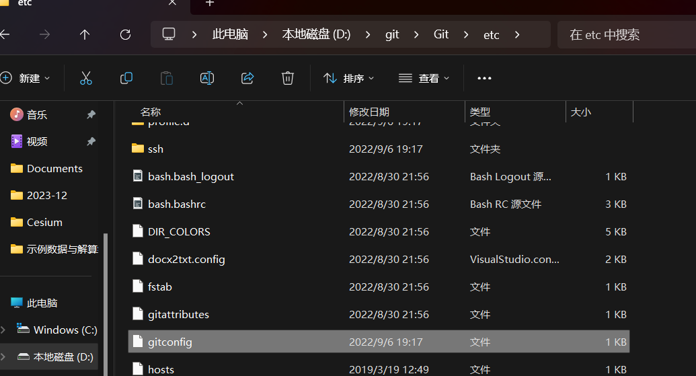
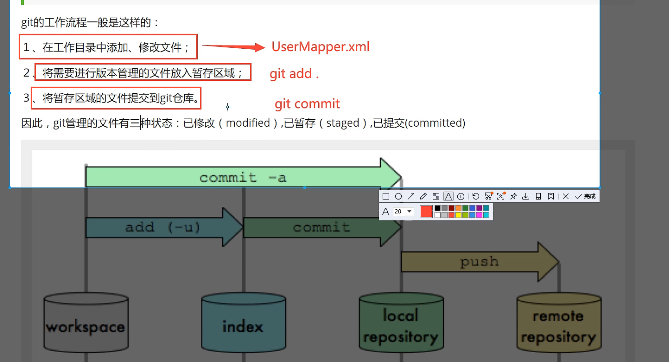
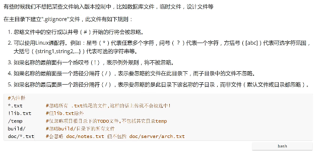

# git
# 安装教程

先安装，如果有的话就删除，删除的时候要把环境变量删除

默认安装完会给你配置环境变量

# 基本命令

>基本的linux命令学习

git 使用教学

1）cd 切换目录

2）cd .. 切换到上一级目录

3）pwd 显示当前路径

4）clear 清屏

5）ls 列出当前目录下的所有文件

6）touch +文件名 新建文件

7）rm +文件名 删除文件

8）mkdir 创建文件夹

9）rm -r 文件夹名 删除文件夹

```
rm -rf / :f递归删除 删除电脑中全部文件
```

10）mv 要移动的文件名 移动位置  移动文件

11）reset 重新初始化终端

12）history 历史命令

13）exit 推出

14）#表示注释

# 配置文件

> Git 配置

git config -l 配置信息

git config --system --list 系统配置信息

git config --global --list 用户配置信息

所有的配置文件都在本地

系统配置文件



用户配置文件


> 设置用户名与邮箱


```
git config --global user.name "xiaokekeq"
git config --global user.email "www.1072639798@gmail.com"
```


# Git 基本理论（核心）


> 工作区

本地有三个工作区：工作目录，暂存区，资源库


```
左边是提交，右边是拉去的过程
```




# Git项目搭建

> 创建工作目录与常用命令


> 本地仓库搭建

创建全新的仓库

```
git init
```

> 克隆仓库

将远程服务器上的仓库完全镜像一份到本地

```
git clone [url]
```


# Git文件操作


>查看文件状态

```
#查看指定文件状态
git status  【files】
#查看所有文件状态
git status
# git add .            提交所有文件
#git commit -m "消息"   提交暂存区中的内容到本地仓库 -m提交信息
```

> 忽略文件



# 使用码云

>github 慢
>
>gitee 国内的
>
>gitlab 自己搭建服务器

1.先注册gitee

2.设置本机绑定SSH公钥，实现面密码登录！

```
# 进入C:\Users\administrator\.ssh目录
# 生成公钥 后面-t rsa 加密形式
ssh-keygen -t rsa 
```


# IDEA 集成Git

1.新建项目

把远程的仓库clone到本地

把.git文件复制到项目中就行

# git分支

```
# 分支常用命令
# 列出所有本地分支
git branch
#列出所有远程分支
git branch -r
#新建一个分支
git branch [branch-name]
# 新建分支，并切换到改分支
git checkout -b [branch]
# 合并指定分支到当前分支
git merge [branch]
# 删除分支 
git branch -d [branch-name]
# 删除远程分支
git push origin --delete [branch-name]
git branch -dr [remote/branch]

```


