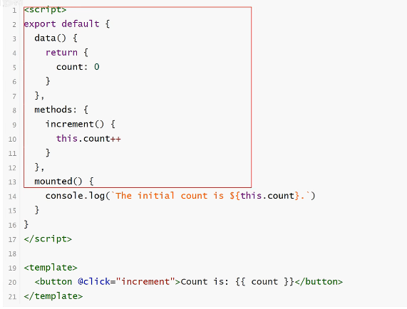
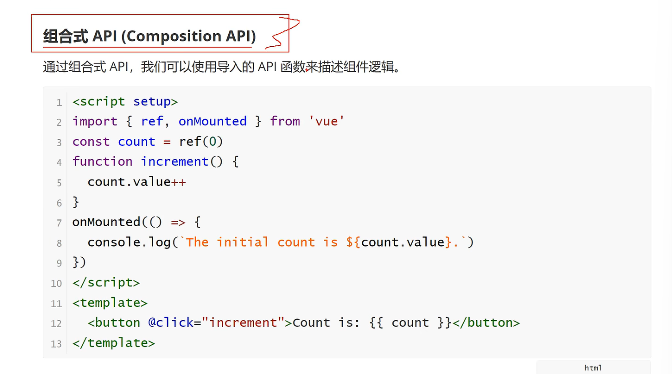
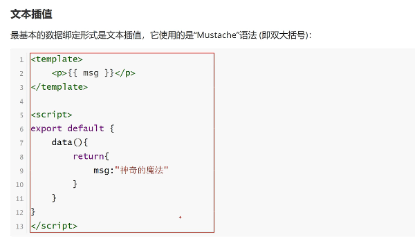
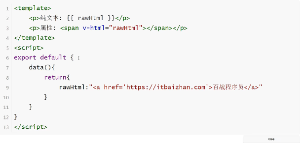
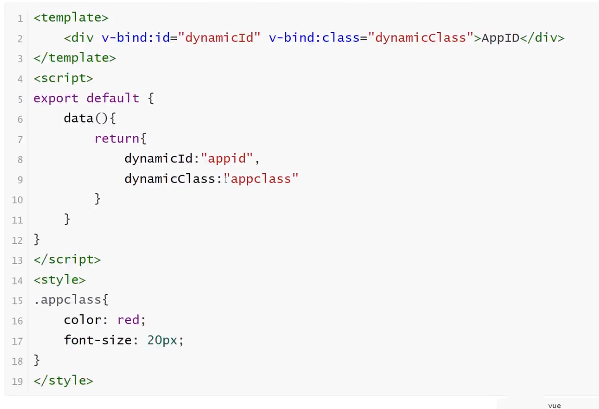
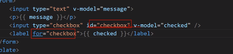

# vue简介_1

vue渐进式JavaScript框架

>**官方文档**
>
>地址：[Vue.js - 渐进式 JavaScript 框架 | Vue.js (vuejs.org)](https://cn.vuejs.org/)

## 渐进式框架

无需构建步骤，渐进式增强静态的HTML

在任何页面中作为Web Components嵌入

单页应用(SPA)

全栈/服务端渲染(SSR)

jamstack/静态站点生成(SSG)

开发桌面端，移动端，WebGL，甚至是命令行终端界面
## vue版本

vue2，vue3

Vue API 风格不同

Vue的组件两种不同风格书写：选项式API（vue2）和组合式API（vue3）

大部分核心概念都是通用的

### 选项式

data，methods和mounted，选项所定义的属性都会暴露在函数内部的this上，他会指向当前的组件实例





# Vue 开发准备

## 创建Vue项目


# Vue项目目录结构


#  模板语法

Vue使用一种基于HTML的模板语法，使我们能够声明式地将其组件实例地数据绑定到呈现地DOM上。所有的Vue模板都是语法层面合法的HTML，可以被复合规范的浏览器和HTML解析器解析。 

## 文本插值



## 使用JavaScript表达式


表达式都可以放在{{}}里面，条件控制不行，但是三目运算符可以他是一个表达式（**要有返回值才可以，且单一表达式**）

## 原始HTML

双括号将会将数据插值为纯文本，而不是HTML。想插入HTML，需要使用v-html指令



# 属性绑定

双大括号不能再HTML attributes中使用，想要响应式地绑定一个attribute，应该使用v-bind指令



v-band指令指示Vue将元素的id attribute与组件的dynamicid属性保持一致。如果绑定的值是null或者undefined，那么该attribute将会从渲染的元素上移除
### 简写

因为v-band经常使用

```vue
<div :id="dynamicId" :class=dynamicClass></div>
```

### 布尔型 Attribute

布尔型 attribute 依据true/false值来决定attribute是否应该存在于该元素上，disabled就说最常见的例子之一

```vue
<template>
	<button :disabled="isButtonDisadbled">
        Button
    </button>
</template>
<script>
    export default{
	data(){
		return{
			isButtonDisadbled:true	
		}
	}
}
</script>

```

### 动态绑定多个值

如果有这样一个包含多个attribute的JavaScript对象

```vue
<template>
	<div v-bind="objectOfattrs">
        cxy
    </div>
</template>
<script>
export default{
	data(){
		return {
			objectOfattrs:{
				id:"123",
                class:"wrapper"
            }
        }
    }
}
</script>
```

# 条件渲染

在***vue***中，提供了条件渲染，这类似于JavaScript中的条件语句

v-if

v-else

v-else-if

v-show


v-if

v-if指令用于条件性地渲染一块内容。这块内容只有在指令表达式返回真值时才被渲染

```vue
<template>
	<div v-if="flag">
        看得见我嘛
    </div>
</template>
<script>
	export default{
		data(){
			return{
				falg:"true"
            }
        }
    }
</script>
```

v-else

可以使用v-else为v-if添加一个else区块

```vue
<template>
	<div v-if="flag">
        see
    </div>
	<div v-else>
        not see
    </div>
</template>
<script>
export default{
	data(){
		return {
			flag:true
        }
    }
}
</script>
```

v-else-if

v-else-if提供相当于v-if的else if区块

```vue
<template>
	<div v-if="type==='A'">
        A
    </div>
	<div v-else-if="type==='B'">
        B
    </div>
	<div v-else-if="type==='C'">
        C
    </div>
	<div v-else>
        A
    </div>
</template>
<script>
export default{
	data(){
        return {
			type:'D'
        }
    }
    
}
</script>
```

v-show

另一个可以用来按条件显示一i个元素的指令时v-show

```vue
<template>
	<div v-show="flag">
        see
    </div>
</template>
<script>
export default{
	data(){
		return {
			flag:true
        }
    }
}
</script>
```

v-if VS v-show

v-if 是真实的按条件渲染，因为它确保了在切换时，条件区块内的事件监听器和子组件都会被销毁于重建。

v-if也是惰性：如果在初次渲染时条件为：false，则不做任何事情。条件区块中有为true时才会渲染

相比之下，v-show简单许多，元素初始条件如何，始终会被渲染，只有CSS **display**属性会被切换

v-show有更高的初始渲染开销，v-if有更高的切换开销

# 列表渲染

v-for 指令基于一个数组来渲染一个列表。v-for指令的值需要使用item in items形式的特殊语法，其中items时源数据的数组，而item时迭代项的别名，v-for可以放两个item还有一个是index

```vue
<template>
	<div>
        <p v-for="item in name">
        	{{item}}    
    	</p>
    </div>
</template>
<script>
export default{
	data(){
		return {
			name:["1","2","3"]
        }
    }
}
</script>
```


## 复杂数据

大多数情况，我们渲染的数据源来源于网络请求，也就是**JSON**格式

```vue
<template>
	<div v-for="item in result">
        <p>   {{item.title}}
   		</p>
        
    </div>
</template>
<script>
export default{
	data(){
		return {
			result:[{
				"id":2261677,
                "title":"123",
                "avator":"456"}
                ,{
				"id":2261676,
                "title":"12",
                "avator":"45"},
                    {
				"id":2261675,
                "title":"1",
                "avator":"4"}
            ]
        }
    }
}
</script>
```


v-for 也支持使用可选的第二个参数表示当前项的位置索引

```vue
<template>
	<div>
        <p v-for="(item,index) in names">
            {{index}}:{{item}}
    	</p>
    </div>
</template>
<script>
export default{
	data(){
        return{
			names:["1","2","2"]
        }
    }
}
</script>
```

v-for 中in可以用of来代替，这样更接近JavaScript的迭代语法

```vue
<div v-for="item of items"></div>
```


v-for与对象

可以使用v-for来遍历一个对象的所有属性，三个值，默认是这三个顺序

```vue
<template>
	<div>
        <p v-for="(value,key,index) of userInfo">
            {{value}}--{{key}}--{{index}}
   		</p>
    </div>
</template>
<script>
export default{
	data(){
		return{
			userInfo:[
                {
                    "id":1,
                    "key":1,
                },
                {
                    "id":2,
                    "key":2,
                },
                {
                    "id":3,
                    "key":3,
                }
            ]
        }
    }
}
</script>
```

# 通过key管理状态

vue默认安装“就地更新”的策略来更新通过v-for渲染的元素列表。当数据项的顺序改变时，vue不会随之移动DOM元素的顺序，而是就地更新每个元素，确保他们在原本指定的索引位置上渲染。

为了给Vue一个提示，以便它可以跟踪每个节点的标识，从而重用和重新排序现有的元素，你需要为每个元素对应的块提供一个唯一的**key**attribute

```vue
<template>
	<div>
        <p v-for="(item,index) in names" :key="index">
            {{item}}
    	</p>
    </div>
</template>
<script>
export default{
	data(){
		return {
			names:["1","2","3"]
        }
    }
}
</script>
```

>key 在这里是一个通过v-bind绑定的特殊attribute
>
>推荐在任何可行的时候为v-for 提供一个key attribute
>
>key绑定的值期望是一个基础类型的值，例如字符串或number类型

**key推荐为数据中的唯一索引**

# 事件处理

我们可以使用v-on指令（@）来监听DOM事件，并在事件触发时执行对应的JavaScript。用法：v-on:click="methodName"或@click="methodName"

## 内联事件处理器

```vue
<template>
	<button @click="click++">
        add1
    </button>
	<p>
      count:{{count}}  
    </p>
</template>
<script>
export default{
	data(){
		return {
			count:0
        }
    }
}
</script>
```

@click="  "或v-on:click="  "

事件处理器可以写有返回值的语句或者函数都可以

* 内联事件处理器：事件被触发时执行的内联JavaScript语句（与onlick类似
* 方法事件处理器：一个指向组件上定义的方法的属性名或是路径

## 方法事件处理器

```vue
<template>
	<button @click="addcount">
        add1
    </button>
	<p>
      count:{{count}}  
    </p>
</template>
<script>
export default{
	data(){
		return {
			count:0
        }
    },
    methods:{
		addcount(){
            //读取data里面的数据的方案：this.count
			this.count++;
        }
    }
}
</script>
```

# 事件传参

事件参数可以获取event对象和通过事件传递数据

## 获取event对象

```vue
<template>
	<button @click="addcount">
        add1
    </button>
	<p>
      count:{{count}}  
    </p>
</template>
<script>
export default{
	data(){
		return {
			count:0
        }
    },
    methods:{
		addcount(e){
            //读取data里面的数据的方案：this.count
            console.log(e)
			this.count++;
        }
    }
}
</script>
```

## 传递参数

```vue
<template>
	<button @click="addcount('123')">//外层是双引号索引只能单引号
        add1
    </button>
	<p>
      count:{{count}}  
    </p>
</template>
<script>
export default{
	data(){
		return {
			count:0
        }
    },
    methods:{
		addcount(msg){
            //读取data里面的数据的方案：this.count
            console.log(msg)
			this.count++;
        }
    }
}
</script>
```

```vue
//最常用:获取列表中的内容
<template>
<div>
        <p v-for="(item,index) of names" :key="index" @click="click_name(item)">{{ item }}</p>
    </div>
</template>
<script>
export default{
	data(){
		return {
			
            names:["iwen","ime","frank"]
        }
    },
    methods:{
        click_name(msg){
            console.log(msg)
        }
    }
}
</script>
```

即要传递参数又要获取事件e：method(parameter1,$event)

```vue
<template>
<div>
        <p v-for="(item,index) of names" :key="index" @click="click_name(item,$event)">{{ item }}</p>
    </div>
</template>
<script>
export default{
	data(){
		return {
			
            names:["iwen","ime","frank"]
        }
    },
    methods:{
        click_name(msg,e){
            console.log(msg);
            console.log(e)
        }
    }
}
</script>
```

# 事件修饰符

在处理事件时条用event.preventDefault()（阻止默认事件）或event.stopPropegation()（阻止事件冒泡）是很常见的，尽管我们可以直接在方法内调用，但如果方法能更专注于**数据逻辑**而不去处理DOM事件细节会更好

为了解决咋搞问题，vue提供了**事件修饰符**

* .stop：阻止冒泡事件
* .prevent：阻止默认事件
* .once：阻止一次性事件
* .enter：阻止键盘事件
* ...

## 阻止默认事件

```vue
<template>
    <h3>事件修饰符</h3>
    <a @click="EventHanler" href="www.baidu.com">baidu</a>
</template>
<script>
export default {
    data() {
        return {

            names: ["iwen", "ime", "frank"]
        }
    },
    methods: {
        EventHanler(e){
            //阻止默认事件
            e.preventDefault();
            console.log("stop");
        }
    }
}
</script>
```

也可以是：

```vue
<template>
    <h3>事件修饰符</h3>
    <a @click.prevent="EventHanler" href="www.baidu.com">baidu</a>//在click这里添加属性.prevent就行，这个.prevent代替了e.preventDefault操作就是事件修饰符
</template>
<script>
export default {
    data() {
        return {

            names: ["iwen", "ime", "frank"]
        }
    },
    methods: {
        EventHanler(e){
            //阻止默认事件
            //e.preventDefault();
            console.log("stop");
        }
    }
}
</script>
```

## 阻止事件冒泡

```vue
<template>
    <h3>事件修饰符</h3>
    <a @click.prevent="EventHanler" href="www.baidu.com">baidu</a>//在click这里添加属性.prevent就行，这个.prevent代替了e.preventDefault操作就是事件修饰符
	<div @click="clickDiv">
        <p @click.Propagation="clickp">
        	测试冒泡    
    	</p>
        
    </div>
</template>
<script>
export default {
    data() {
        return {

            names: ["iwen", "ime", "frank"]
        }
    },
    methods: {
        EventHanler(e){
            //阻止默认事件
            //e.preventDefault();
            console.log("stop");
        },
        clickDiv(){
			console.log("div");
        },
        clickp(e){
            //阻止事件冒泡
            //e.stopPropagation();
			console.log("p");
        }
    }
}
</script>
```

> 事件冒泡：
>
> 触发子元素冒泡到父元素，父元素也被触发了
>
> 阻止事件冒泡：
>
> e.stopPropagation();，也可以是@click.Propagation

# 数组变化侦测

## 变更方法

vue能够侦听响应式数组的变更方法，并在它们被调用时触发相关的更新方法包括：（==数组变化UI会得到相应响应==）

* push()
* pop()
* shift()
* unshift()
* splice()
* sort()
* reverse()

```vue
<template>
    <h3>数组变化侦听</h3>
    <button @click="addListHandle"> 添加数据</button>
	<ul>
        <li v-for="(item,index) of names" :key="index">{{ item }}</li>
    </ul>
</template>
<script>
export default{
	data(){
		return {
			count:0,
            names:["iwen","ime","frank"]
        }
    },
    methods:{
		addListHandle(){
            this.names.push("sakura");
        }
    }
}
</script>
```

 ## 替换一个数组

变更方法，就说会对调用它们的原数组进行变更，也有一些不可变方法，例如<font style="background:#f8f6e8" color="#ffb0a1">fliter()</font>，<font style="background:#f8f6e8" color="#ffb0a1">concat()</font>和<font style="background:#f8f6e8" color="#ffb0a1">slice()</font>，这些都不会更改原数组，而总是**返回一个新数组**，当遇到的是非变更方法时，我们需要将旧的数组替换为新的数组

```vue
<template>
    <h3>数组1</h3>
	<p v-for="(item,index) of nums1" :key=index>
        {{item}}
    </p>
	<h3>数组2</h3>
	<p v-for="(item,index) of num2" :key=index>
        {{item}}
    </p>
 <button @click="filterHanle"> 添加数据</button>
</template>
<script>
export default{
	data(){
		return {
			count:0,
            names:["iwen","ime","frank"],
            num1:[1,2,3,4,5],
            num2:[2,3,6,7,8]
        }
    },
    methods:{
		filterHanle(){
            //引起UI自动更新
            //this.names.push("sakura");
            //不会引起UI自动更新
            //this.names.concat(["sakura"]);
            //想要变化的话直接：this.name= 		this.names.concat(["sakura"]);
            this.num1=this.num1concat(this.num2)
            
        }
    }
}
</script>
```

# 计算属性

模板中的表达式虽然方便，但也只能用来做简单的操作，如果在模板中写太多逻辑，会让模板变得臃肿，难以维护，因此我们推荐使用**计算属性**来描述依赖响应式状态的复杂逻辑

```vue
<template>
    <h3>
        {{ itbaizhan.name }}
    </h3>
    <p>{{ itbaizhan.content.length >0 ? 'yes':'no' }}</p>
    <p>{{  itbaizhanContent}}</p>
    <p> {{itbaizhanContents()  }}</p>
</template>

<script>
export default{
    data(){
        return{
            itbaizhan:{
                name:"123",
                content:["qd","java","python"]
            }
        }
    },
    //计算属性
    computed:{
        itbaizhanContent(){
            this.itbaizhan.content.length >0 ? 'yes':"no"
        }
    },
    //方法
    methods:{
        itbaizhanContents(){
            this.itbaizhan.content.length >0 ? "yes":"no"
        }
    }
    //methods是方法调用时要加上括号
    //computed是计算属性不用加括号
    //它们的区别在于计算属性调用多次只计算一次
    //方法每次调用都要计算一次
}
</script>
```

> 区分
> 计算属性：**计算属性值会基于其响应式依赖缓存**，一个计算属性金辉在其响应式依赖更新时才会重新计算
>
> 方法：方法调用**总是**会在重渲染发生时再次执行函数

# Class绑定

 数据绑定的一个常见需求场景是操纵元素的CSS class列表，因为**class**是attribute ，我们可以和其他attribute一样使用**v-bind**将它们和动态的字符串绑定。但是在处理比较复杂的绑定时，通过拼接生成字符串是麻烦且容易出错的，因此，vue专门为**class**的**v-bind**用法提供了特殊的功能增强。除了**字符串**外，表达式的值也可以是**对象或数组**

## 绑定对象

```vue
<template>
    <p :class="{avtive:isActive,'text-danger':hasError}">Class 样式绑定</p>

</template>
<script>
export default{
    data(){
        return{
            isActive:true,
            hasError:true
        }
    },
    methods:{

    }
}
</script>
<style>
.active{
    font-size: 30px;
}
.text-danger{
    color:red;
}
</style>
```

## 多个对象绑定

```vue
<template>
    <p :class="classObject">Class 样式绑定</p>

</template>
<script>1
export default{
    data(){
        return{
            classObject:{
				'isActive':true,
            	'hasError':true
            }
            
        }
    },
    methods:{

    }
}
</script>
<style>
.active{
    font-size: 30px;
}
.text-danger{
    color:red;
}
</style>
```

## 绑定数组

```vue
<template>
  	<div :class="[activeClass,errorClass]">
        isActive
    </div>
</template>
<script>1
export default{
    data(){
        return{
            activeClass:'active',
            errorClass:'text-danger'
        }
    },
    methods:{

    }
}
</script>
<style>
.active{
    font-size: 30px;
}
.text-danger{
    color:red;
}
</style>
```

如果想在数组中有条件地渲染某个class，可以使用三元表达式

```vue
<template>
	<div :class="[isActive?"actice text-danger",""]">
        isActive
    </div>
</template>
<script>
export default{
	data(){
		return{
			isActive:true
        }
    }
}
</script>

```

## 数组和对象

```vue
<template>
	<div :class="[{'active':isActive},errorClass]">
        
    </div>
</template>
<script>
export default{
	data(){
		return{
			isActive:true,
            errorClass:"text-danger"
        }
    }
}
</script>
```

> **温馨提示**
>
> 数组和对象嵌套，只能数组嵌套对象

# style绑定

数据绑定地一个常见需求场景是操纵元素的CSS style列表，因为style是attribute，我们可以和其他attribute一样使用v-bind将它们和动态的字符串绑定。但是在处理比较复杂的绑定时，通过拼接生成字符串是麻烦且容易出错的，因此vue专门为style的v-bind用法提供了特殊的功能增强，除了字符串外，表达式的值也可以是对象或数组

## 绑定对象

```vue
<template>
    <p :style="{color:activeColor,fontSize:fontSize+'px'}">style绑定</p>
    <p :style="styleOvject">style绑定</p>
</template>
<script>
export default{
    data(){
        return{
            activeColor:'red',
            fontSize:30,
            styleOvject:{
                color:'red',
                fontSize:"30px"
            }
        }
    }
}
</script>
```

## 绑定数组

style绑定一个**包含多个样式对象的数组**

```vue
<template>
    <p :style="[styleobject1,styleobject2,{background:'green'}]">style数组绑定</p>
</template>
<script>
export default{
    data(){
        return{
            activeColor:'red',
            fontSize:30,
            styleOvject:{
                color:'red',
                fontSize:"30px"
            },
            styleobject1:{
                color:'red',
            },
            styleobject2:{
                fontSize:"30px"
            }
        }
    }
}
</script>


```

# 侦听器(==页面数据的变化==)

使用**watch**选项在每次**响应式**属性发生变化时触发一个函数

data中声明的数据，通过**双花括号模板语法**绑定的数据

```vue
<template>
    <h3>侦听器</h3>
    <p>{{ message }}</p>
    <button @click="updateHandle">修改数据</button>
</template>
<script>
export default {
    //响应式数据对象
    data(){
        return{
            message:"hellow"
        }
    },
    //方法事件对象
    methods:{
        updateHandle(){
            this.message="world";
        }
    },
    //计算属性对象
    computed:{

    }
    //侦听器
    watch:{
        //newValue：改变之后的数据
        //oldValue：改变之前的数据
        //函数名必须于侦听的数据对象名保持一致
        message(newValue,oldValue){
            //数据发生变化，自动执行的函数
            console.log(newValue,oldValue);
        }
    }

}
</script>
```

> watch是个对象，里面写的函数名要与变化数据名相同

# 表单输入绑定

在前端处理表单时，我们常常要将表单输入框的内容同步给JavaScript中相应的变量，手动连接值绑定和更改事件监听器可能会很麻烦，v-model指令帮我们简化了这一步（**输入框，复选框，修饰符**都可以）

## 输入框

```vue
<template>
    <h3>表单输入绑定</h3>
    <form>
        <input type="text" v-model="message">
        <p>{{ message }}</p>
        
    </form>
</template>
<script>
export default {
    data(){
        return{
            message:"",
            checked:false
        }
    },
    methods:{

    }
}
</script>
```

## 复选框

单一的复选框，绑定布尔类型值

```vue
<template>
    <h3>表单输入绑定</h3>
    <form>
        
        <input type="checkbox" id="checkbox" v-model="checked">
        <label for="checkbox">{{ checked }}</label>
    </form>
</template>
<script>
export default {
    data(){
        return{
            checked:false
        }
    },
    methods:{

    }
}
</script>
```



> 每个label绑定一个id

## 修饰符

v-model提供了修饰符：**.lazy,.number（只接收数子）,.itrim（取消前后空格）**

**.lazy**

默认情况下，v-model会在每次input事件后更新数据，可以添加**.lazy**修饰符来改为在每次change事件后更新数据（失去焦点的时候就会更新）

```vue
<template>
    <h3>表单输入绑定</h3>
    <form>
        <input type="text" v-		model.lazy="message_change">
        <p>{{ message_change }}</p>
    </form>
</template>
<script>
export default {
    data(){
        return{
            message_change:""
        }
    },
    methods:{

    }
}
</script>
```

# 模板引用（获取DOM操作）

vue的声明性渲染模型抽象了大部分对DOM的直接操作，但在某些情况下，仍然需要直接访问底层DOM元素，要实现这一点，我们可以使用特殊的**ref** attribute

挂载结束后引用都不会被暴露在this.$refs之上

> 本质上DOM就说HTML元素例如：p标签，div，ul，ol这些

> 内容改变：{{模板语法}}
>
> 属性改变：v-bind：指令
>
> 事件：v-on：click
>
> 如果没有特别的需求，不要操作DOM

```vue
<template>
    <div  ref="container" class="container">{{ content }}</div>
    <input type="text" ref="userName">
    <button @click="getElementHandle">获取元素(DOM)</button>
</template>
<script>
export default {
    data(){
        return{
            content:"内容"
        }
    },
    methods:{
        getElementHandle(){
            //innerHTML：原生JS属性
            //this.$refs.container获取ref为container的DOM元素
            //console.log(this.$refs.container.innerHTML="hhh");
            console.log(this.$refs.userName.value);
        }
    }
}
</script>
```


