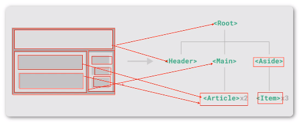
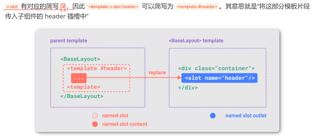
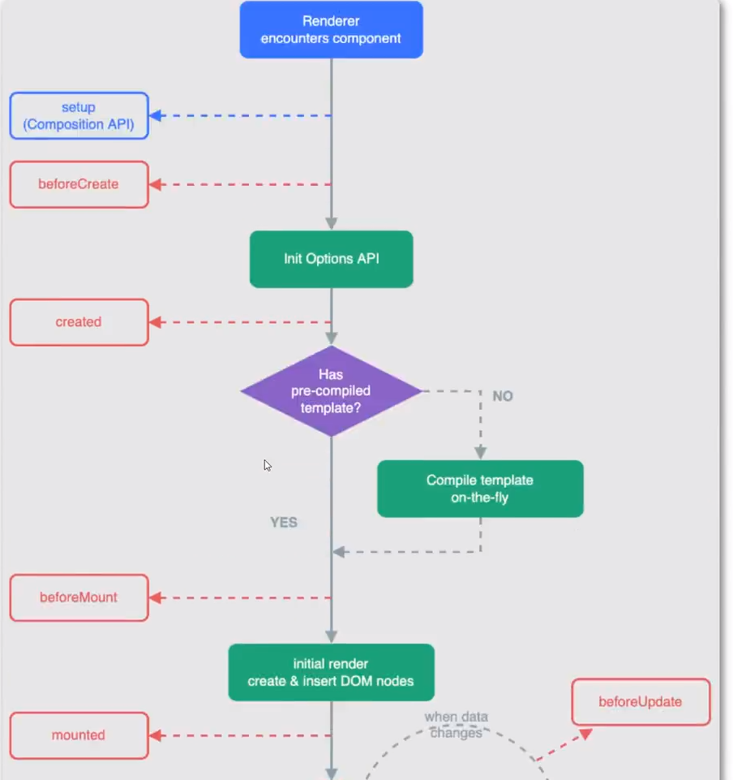
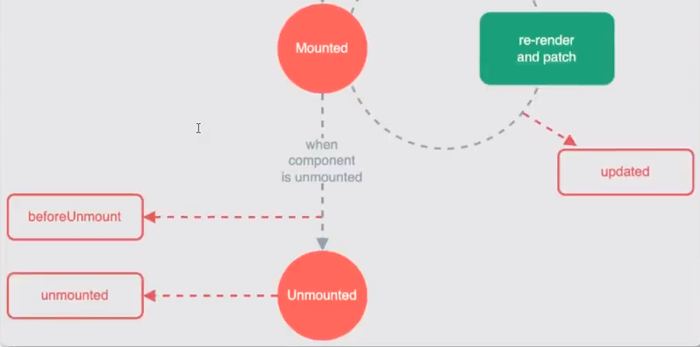
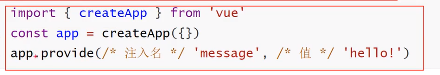
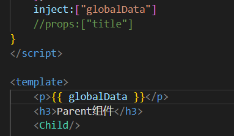
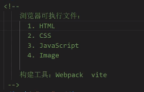

# Vue简介_2


# 组件组成

组件最大的优势时可复用性

当使用构建步骤时，一般会将Vue组件定义在一个单独的.vue文件中，着叫做单文件组件（简称SFC）

## 组件组成结构

```vue
<template>
	<div>
        承载标签
    </div>
</template>
<script>
export default {
   //业务逻辑
}
</script>
<style scoped>
    样式
</style>
```

> template是必须的，但是script和style是可选的

## 组件的引用

第一步：在script中import 组件名称 from 组件位置

第二步：在script中的export default 中注入组件

第三步：在template显示组件<组件名称 />


第二步注入组件正常是：component：{ Mycomponent:Mycomponent }**但是在ES6中特性前后名字一致可以省略**

`<style scoped>  <style>`

scoped让当前样式只在当前组件生效

**如果不加scoped则为全局样式**

scoped限制作用域

# 组件嵌套关系



组件允许将UI划分为独立的，可重用的部分，并且可以对每个部分进行单独的思考，在实际应用中，组件常常被组织成层层嵌套的树状结构

这和嵌套HTML元素方式类似，Vue实现了自己的组件模型，可以在每个组件内封装自定义内容于逻辑

## 创建组件及引用关系

Header

```vue
<script >
</script>
<template>
  <h3>Header</h3>
</template>

<style scoped>
h3{
    width: 100%;
    height: 100%;
    border: 5px solid #999;
    text-align: center;
    line-height: 100px;
    box-sizing: border-box;
}
</style>

```

Main

```vue
<template>
    <div class="main">
        <h3>Main</h3>
        <Article />
        <Article />
    </div>
    
</template>
<script>
import Article from './Article.vue'
export default {
    components:{
        Article
    }
}
</script>

<style>
.main{
    float:left;
    width: 70%;
    height: 600px;
    border: 5px solid #999;
    box-sizing: border-box;
}
</style>
```

Aside

```vue
<template>
    <div class="aside">
        <h3>Aside</h3>
        <Item/>
        <Item/>
        <Item/>
    </div>
</template>
<script>
import Item from "./Item.vue"
export default {
    components:{
        Item
    }
}
</script>
<style scoped>
.aside{
    float: right;
    width: 30%;
    height: 600px;
    border: 5px solid #999;
    box-sizing: border-box;
    border-left: 0;
}
</style>

```

Item

```vue
<template>
    <h3>Item</h3>

    
</template>
<script>

</script>
<style scoped> 
h3{
    width: 80%;
    margin: 0 auto;
    text-align: center;
    line-height: 100px;
    box-sizing: border-box;
    margin-top: 50px;
    background:#999;
}


</style>
```

Article

```vue
<template>
    <h3>Article</h3>
</template>
<script>

</script>
<style scoped>
h3{
    width: 80%;
    margin: 0 auto;
    text-align: center;
    line-height: 100px;
    box-sizing: border-box;
    margin-top: 50px;
    background:#999;
}
</style>


```

# 组件注册方式

一个Vue组件在使用前需要先被“注册”，这样Vue才能在渲染模板时找到其对应的实现。组件注册有两种方式：全局注册和局部注册

## 全局注册

```vue
import {createApp} from 'vue'
import App from './App.vue'
import GlobalComponent from './component/GlobalComponent.vue'

const app=createApp(App);
app.component("GlobalComponent",GlobalComponent)
//在这中间写组件注册
app.mount('#app');
```

```vue
<template>
	<h3>
        全局应用组件
    </h3>
</template>
```

## 局部注册

全局注册显然和方便，但有一下问题：

* 全局注册，但并没有被使用的组件无法在生产打包时被自动移除（也叫“tree-shaking”），如果全局注册了一个组件，即使他并没有被实际使用，它仍然会出现在打包后的JS文件中
* 全局注册在大型项目的依赖关系变得不那么明确，在父组件中使用子组件时，不太容易定位子组件的实现，和使用过多的全局变量一样，这可能会影响应用长期的可维护性

局部注册需要使用component选项

```vue
<template>
	<GlobalComponent/>
</template>
<script>
import GlobalComponent from './component/GlobalComponent.vue'
   export default {
		components:{
			GlobalComponent
        }
   }
</script>
```

# 组件传递数据_Props

组件与组件之间不是完全独立的，而是有交集的，那就是组件与组件之间是可以传递数据的，传递数据的解决方案时props

## 传递数据

```vue
<template>
    <h3>Parent</h3>
    <Child title="Parent数据" demo="test"/>
</template>
<script>
import Child from './child.vue'
export default {
    data(){
        return{

        }
    },
    components:{
        Child
    }
}
</script>
```

```vue
<template>
    <h3>Child</h3>
    <p>{{ title }}</p>
	<p>
        {{demo}}
    </p>
</template>
<script>
export default {
    data(){
        return{
            
        }
    },
    props:["title","demo"]
}
</script>
```

> 传递数据数量没有限制

## 动态传递数据

```vue
<template>
    <h3>Parent</h3>
    <Child :title="message" demo="test"/>
</template>
<script>
import Child from './child.vue'
export default {
    data(){
        return{
            message:"Parent数据!"
        }
    },
    components:{
        Child
    }
}
</script>
```

v-bind属性绑定进行动态传递数据

> **注意事项**
>
> `props`传递数据，只能父级传递到子集，

# 组件传递多种数据类型

通过`props`传递数据，不仅可以传递字符串类型的数据，还可以传递其他类型，例如：数字，对象，数组等

但实际上**任何类型的值**都可以作为props的值被传递

**Number**

```vue
<template>
    <h3>Parent</h3>
    <Child :age="age"/>
</template>
<script>
import Child from './child.vue'
export default {
    data(){
        return{
            message:"Parent数据!",
            age:20
        }
    },
    components:{
        Child
    }
}
</script>
```

```vue
<template>
    <h3>Child</h3>
    <p>{{ age }}</p>
</template>
<script>
export default {
    data(){
        return{
            
        }
    },
    props:["age"]
}
</script>
```


**Arry**

```vue
<template>
    <h3>Parent</h3>
    <Child :names="names"/>
</template>
<script>
import Child from './child.vue'
export default {
    data(){
        return{
            names:["iwen","ime","frank"],
        }
    },
    components:{
        Child
    }
}
</script>
```

```vue
<template>
	<p v-for="(item,index) of names" :key="index">{{ item }}</p>  
</template>
<script>
export default {
    data(){
        return{
            
        }
    },
    props:["names"]
}
</script>
```

**Object**

```vue
<template>
    <h3>Parent</h3>
    <Child :title="message" demo="test" :age="age"
    :names="names" :userinfo="userinfo"/>
</template>
<script>
import Child from './child.vue'
export default {
    data(){
        return{
            message:"Parent数据!",
            age:20,
            names:["iwen","ime","frank"],
            userinfo:{
                name:"iwen",
                age:30,
            }
        }
    },
    components:{
        Child
    }
}
</script>
```

```vue
<template>
    <h3>Child</h3>

    <p v-for="(item,index) of names" :key="index">{{ item }}</p>
    <p>{{ userinfo.name }}</p>
    <p>{{ userinfo.age }}</p>
</template>
<script>
export default {
    data(){
        return{
            
        }
    },
    props:["title","demo","age","names","userinfo"]
}
</script>
```

# 组件传递Props效验

vue组件可以**更细致地声明**对传入的props地校验要求

```vue
<template>
    <P>ComponentA</P>
    <ComponentB :title="title"/>
</template>
<script>
import ComponentB from './ComponentB.vue'
export default {
    data(){
        return{
            title:20
        }
    },
    components:{
        ComponentB
    }

}
</script>
```

```vue
<template>
    <p>ComponentB</p>
    <p>{{ title }}</p>
</template>
<script>
export default {
    data(){
        return{
           
        }
    },
    props:{
        title:{
            type:[String,Object,Array,Number]
        }
    }

}
</script>
```

## 默认值

```vue
<template>
    <p>ComponentB</p>
    <p>{{ age }}</p>
</template>
<script>
export default {
    data(){
        return{   
        }
    },
    props:{
        age:{
            type:Number,
            default:0
        }
    }

}
</script>
```

> 数字和字符串可以直接default，但是如果时数字或者对象，必须通过工厂函数返回默认值

```vue
<template>
    <p>ComponentB</p>
    <p>{{ title }}</p>
    <p>{{ age }}</p>
    <ul>
        <li v-for="(item,index) of names" :key="index">{{ item }}</li>
    </ul>
</template>
<script>
export default {
    data(){
        return{
           
        }
    },
    props:{
        names:{
            type:Array,
            default(){
                return["null"]
            }
        }
    }

}
</script>
```

## 必选项

```vue
<template>
    <p>ComponentB</p>
    <p>{{ title }}</p>
</template>
<script>
export default {
    data(){
        return{ 
        }
    },
    props:{
        title:{
            type:[String,Object,Array,Number],
            //必选项
            required:true
        }
    }

}
</script>
```

`required`必选项为true则要传递值，否则报警告

> **温馨提示**
>
> prop是只读数据，不可以被修改

# 组件事件

组件传递数据

在组件地模板表达式中，可以直接使用`$emit`方法触发自定义事件

触发自定义事件地目的是组件之间**传递数据**

**子传递父**：this.$emit("事件名称",传递数据)

子传递一个事件和数据到父组件，父组件引入子组件，在子组件上挂载事件，在methods获取数据实现。

```vue
<template>
    <P>组件事件</P>
    <ComponentEventChild @someEvent="getEvent"/> 
    <p>ParentElement    {{ message }}</p>
</template>
<script>
import ComponentEventChild from './ComponentEventChild.vue';
export default {
    data(){
        return{
            message:""
        }
    },
    methods:{
        getEvent(data){
            console.log("触发了  ");
            this.message=data;
        }
    },
    components:{
        ComponentEventChild
    }
}
</script>
```

> 子组件的事件是要挂载到子元素上的

```vue
<template>
    <P>Child组件事件</P>
    <button @click="clickEventHandle">Child传递数据Parent</button>
</template>
<script>

export default {
    data() {
        return{
            msg:"Child数据"
        }
    },
    methods:{
        clickEventHandle(){
            //自定义事件
            this.$emit("someEvent",this.msg)
            //父级要实现的事件名称someEvent，数据的传递data
        }
    }
    
}
</script>
```

> **温馨提示**
>
> 父传子：`peops`
>
> 子传父：`自定义事件(this.$emit())`

 # 组件事件配合`v-model`使用

如果用户输入，希望在获取数据的同时发送数据配合`v-model`来使用

```VUE
<template>
    <P> 组件事件配合v-model使用_search</P>
    <br/>
    搜索：<input type="text" v-model="search" >
</template>
<script>

export default {
    data() {
        return{
          search:""
        }
    },
    methods:{
        
    },
    watch:{
        search(newValue,oldValue){
            this.$emit("searchEvent",newValue)
        }
    }
    
}
</script>
```

```vue
<template>
    <p>Main</p>
    <p>{{ search }}</p>
    <searchComponent @searchEvent="getsearch"/>
    
</template>
<script>
import searchComponent from './searchComponent.vue';
export default {
    data() {
        return{
            search:""
        }
    },
    methods:{
        getsearch(data){
            this.search=data;
        }
    },
    components:
    {
        searchComponent
    },

    
}
</script>
```

# 组件数据传递

组件之间的数据传递`props`和自定义事件两种方式

1. `props`：父传子
2. 自定义事件：子传父

`props`也是可以实现子传父，**是可以传递函数，通过这个函数进行实现子传父**

```vue
<template>
    <h3>ComponentAA</h3>
    <p>{{ message }}</p>
    <ComponentBB title="标题" :onEvent="dataFn"/>
</template>
<script>
import ComponentBB from './ComponentBB.vue';
export default {
    data() {
        return{
          message:""
        }
    },
    methods:{
        dataFn(data){
            console.log(data);
            this.message=data;
        }
    },
    components:{
        ComponentBB
    }
}
</script>
```

```vue
<template>
     <h3>ComponentBB</h3>
     <p>{{ title }}</p>
     <p>{{ onEvent("传递数据") }}</p>
</template>
<script>

export default {
    data() {
        return{
         
        }
    },
    methods:{
        
    },
    props:{
        title:{
            type:String
        },
        onEvent:{
            type:Function
        }
    }
}
</script>
```

# 透传Attribute（了解）

## 透传attribute

透传attribute是指传递给一个组件，却没有被该组件声明为props或emits的attribute 或者v-on事件监听器，最常见的例子就说`class`，`style`和`id`

当一个组件以单个元素韦根本渲染时，透传的attribute会自动被添加到根元素上

```vue
<template>
    <!-- 必须时唯一根元素 -->
    <h3>透传属性</h3>
</template>
<script>
export default{
    data(){
        return{

        }
    }
}
</script>
<style>
.attr-container{
    color:red;
}
</style>
```

在app中引入注入，显示标签`<attrComponent class="attr-container"/>`

## 禁用attributes继承

```vue
<template>
    <!-- 必须时唯一根元素 -->
    <h3>透传属性</h3>
</template>
<script>
export default{
    inheritAttrs:false//禁用attribute继承
}
</script>
<style>
.attr-container{
    color:red;
}
</style>
```

# 插槽Slot

## 插槽slot

组件能够接受任意类型的JavaScript作为props，但组件要如何接受模板内容（HTML元素如：p标签，div标签）在某些情况下。要为子组件传递一些模板片段，让子组件在它们的组件中渲染这些片段

> 数据的传递，模板内数据的传递，标签数据

```vue
<script>
import SlotBase from './components/SlotBase.vue';
export default {
  data(){
    return{

    }
  },
  components:{
    SlotBase,
  }
}
</script>

<template>
  <SlotBase>
    <div>
      <h3>插槽标题</h3>
      <p>插槽内容</p>
    </div>
  </SlotBase>
</template>

<style scoped>

</style>

```

```vue
<template>
    <h3>插槽基础知识</h3>
    <slot></slot>
</template>
<script>
export default {
    data(){
        return{

        }
    }
}
</script>
```

`<slot>`元素是一个**插槽出口**（slot outlet），标示了父元素提供的**插槽内容**（slot content）将在哪里渲染


## 渲染作用域

**插槽内容可以访问到父组件的数据作用域**，因为插槽内容本身是在父组件模板中定义的

```vue
<script>
import SlotTwo from './components/SlotTwo.vue';
export default {
  data(){
    return{
      message:"插槽内容续集"
    }
  },
  components:{
    SlotTwo,
  }
}
</script>

<template>
  <SlotTwo>
    <h3>{{ message }}</h3>
  </SlotTwo>
</template>

```

```vue
<template>
    <h3>Slot插槽续集</h3>
    <slot></slot>
</template>
<script>
export default {
}
</script>

```

## 默认内容

在外部没有提供任何内容的情况下，可以为插槽指定默认内容

```vue
<template>
	<h3>
        ComponentB
    </h3>
	<slot>插槽默认值</slot>
</template>
```

## 具名插槽

```VUE
<template>
    <h3>Slot插槽续集</h3>
    <slot name="Header">插槽默认值</slot>
    <hr>
    <a href="#">我是插入在中间的内容</a>
    <slot name="main">插槽默认值</slot>
</template>
<script>
export default {
    data(){
        return{
            
        }
    }
}
</script>
```

```VUE
<script>
import SlotTwo from './components/SlotTwo.vue';
export default {
  data(){
    return{
      message:"插槽内容续集"
    }
  },
  components:{
    SlotTwo,
  }
}
</script>
<template>
  <SlotTwo>
    <template v-slot:Header>
      <h3>{{ message }}</h3>
    </template>
    <template v-slot:main>
      <p>内容</p>
    </template>
  </SlotTwo>
</template>
<style scoped>
</style>
```



```vue
<SlotTwo>
    <template #Header>//#与这个v-slot:一样效果
      <h3>{{ message }}</h3>
    </template>
    <template v-slot:main>
      <p>内容</p>
    </template>
  </SlotTwo>
```

# 插槽Slot（再续集）

在某些场景下插槽内容可能想要同时使用父组件域内和子组件域内的数据，可以像对组件传递props那样，向一个插槽出口上传递attributes

```vue
<script>
import SlotAttr from './components/SlotAttr.vue';
export default {
  data() {
    return {
      cuttentTest: "测试内容"
    }
  },
  components: {
    SlotAttr
  }
}
</script>
<template>
  <SlotAttr v-slot="slotProps">
    <h3> {{ cuttentTest }} -{{ slotProps.msg }}</h3>
  </SlotAttr>
</template>
<style scoped></style>
```

```vue
<template>
    <h3>插槽Slot再续集</h3>
    <slot :msg="childMessage">Slot默认值</slot>
</template>
<script>
export default {
    data(){
        return {
            childMessage:"子组件数据"
        }
    },
}
</script>
```

## 具名插槽传递数据

```vue
<template>
    <h3>插槽Slot再续集</h3>
    <slot :msg="childMessage" name="Header">Slot默认值</slot>
    <slot name="main" :job="jobMessage"></slot>
</template>
<script>
export default {
    data(){
        return {
            childMessage:"子组件数据",
            jobMessage:"itibaizhan"
        }
    },
}
</script>
```

```vue
<script>
import SlotBase from './components/SlotBase.vue';
import SlotTwo from './components/SlotTwo.vue';
import SlotAttr from './components/SlotAttr.vue';
export default {
  data() {
    return {
      message: "插槽内容续集",
      cuttentTest: "测试内容"
    }
  },
  components: {
    SlotBase,
    SlotTwo,
    SlotAttr
  }
}
</script>

<template>
  <SlotAttr>
    <template #Header="slotProps">
      <h3> {{ cuttentTest }} -{{ slotProps.msg }}</h3>
    </template>
    <template #main="slotProps">
      <p>{{ slotProps.job }}</p>
    </template>
  </SlotAttr>
</template>

<style scoped></style>

```

# 组件生命周期

每个vue组件实例在创建时都需要经历一系列的初始化步骤，比如设置好数据侦听，编译模板，挂载实例到DOM，以及在数据改变更新DOM。在此过程中，它会运行被称为生命周期钩子的函数，让开发者有机会在特定阶段运行自己的代码

> * 生命周期函数
> * 创建期：beforeCreate    created
> * 挂载期：beforeMounte    mounted
> * 更新期：beforeUpdate    updated
> * 销毁期：beforeUnmount   unmounted

```vue
<script>
export default {
  data(){
    return{
      message:"数据更新之前"
    }
  },
  methods:{
    updateHandle(){
      this.message="数据更新之后"
    }
  },
  beforeCreate(){
    console.log("组件创建之前");
  },
  created(){
    console.log("组件创建之后");
  },
  beforeMount(){
    console.log("组件渲染之前");
  },
  mounted(){
    console.log("组件渲染之后");
  },
  beforeUpdate(){
    console.log("组件更新之前");
  },
  updated(){
    console.log("组件更新之后");
  },
  beforeUnmount(){
    console.log("组件销毁之前");
  },
  unmounted(){
    console.log("组件销毁之后");
  }
}
</script>

<template>
  <h3>组件的生命周期</h3>
  <p>{{ message }}</p>
  <button @click="updateHandle">更新数据</button>
</template>
```

# 生命周期应用

组件的生命周期会随着我们对`vue`的了解越多，越重要

1. 通过`ref`获取DOM结构
2. 模拟网络请求渲染数据

## 通过ref获取元素DOM结构

```vue
<template>
    <h3>组件生命周期函数应用</h3>
    <p ref="name">百战程序员</p>
</template>
<script>
export default {
    beforeMount(){
        console.log(this.$refs.name);//undefined
    },
    mounted(){
        console.log(this.$refs.name);
    }
}

</script>
```

```VUE
<script>
import userComponent from './components/userComponent.vue';
export default {
  components:{
    userComponent,
  }
}
</script>
<template>
<userComponent />
</template>
<style scoped>
</style>

```

## 模拟网络请求渲染数据

```vue
<template>
    <h3>组件生命周期函数应用</h3>
    <p ref="name">百战程序员</p>
    <ul>
        <li v-for="(item,index) of banner " :key="index">
        {{ item.title }}:{{ item.content }}
        </li>
    </ul>
</template>

<script>
export default {
    data(){
        return{
            banner:[]
        }
    },
    beforeMount(){
        console.log(this.$refs.name);
    },
    created(){
        this.banner=[{
                'title':1,
                'content':"1"
            },
            {
                'title':2,
                'content':"2"
            },
            {
                'title':3,
                'content':"3"
            }]
    },
    mounted(){
        console.log(this.$refs.name);
        this.banner=[{
                'title':1,
                'content':"1"
            },
            {
                'title':2,
                'content':"2"
            },
            {
                'title':3,
                'content':"3"
            }]
    }
}

</script>
```





**组件渲染完成之后再去获取数据**

# 动态组件

有些场景需要在两个组件来回切换，比如Tab界面

**tabComponent赋值一定是要字符串**

```vue
<template>
    <h3>ComponentB</h3>
</template>
```

```vue
<template>
    <h3>ComponentA</h3>
</template>
```

```vue
<script>
import componentB from './components/componentB.vue';
import componentA from './components/componentA.vue';
export default {
  data(){
    return{
      tabComponent:"componentA",
      messgae:componentB,
    }
  },
  methods:{
    changeHandle(){
      this.tabComponent=this.tabComponent=="componentA"?"componentB":"componentA";
    }
  },
  components:{
    componentA,
    componentB,
  }
}
</script>
<template>
<component :is="tabComponent"></component>
<button @click="changeHandle">changeComponent</button>
</template>
```

# 组件报错存活

当使用`<component :is="">`来在多个组件间切换时，被切换掉的组件会被卸载，通过`<keep-alive>`组件强制被切换掉的组件仍然保持存活的状态

## 组件被卸载

## beforeUnmount和unmounted

```vue
<template>
    <h3>ComponentA</h3>
</template>
<script>
export default {
    beforeUnmount(){
        console.log("组件卸载之前")
    },
    unmounted(){
        console.log("组件卸载之后")
    },
}
</script>
```

## 组件被保留

```vue
<KeepAlive>
  <component :is="tabComponent"></component>
</KeepAlive>
```

```vue
<template>
    <h3>ComponentA</h3>
    <p>{{ messgae }}</p>
    <button @click="updataHandle">更新数据</button>
</template>
<script>
export default {
    data(){
        return{
            messgae:"老数据",
        }
    },
    methods:{
        updataHandle(){
            this.messgae="新数据";
        }
    },
    beforeUnmount(){
        console.log("组件卸载之前")
    },
    unmounted(){
        console.log("组件卸载之后")
    },
}
</script>
```

 # 异步组件（优化组件性能）

在大项目中，可能需要拆分应用为更小的块，并仅在需要时在从服务器加载相关组件，Vue提供了`defineAsyncComponent`方法来实现此功能

```vue
<script>
const componentB=defineAsyncComponent(()=>
import('./components/componentB.vue')
)
import { defineAsyncComponent } from 'vue';
import componentA from './components/componentA.vue';
export default {
  data(){
    return{
      tabComponent:"componentA",
      messgae:componentB,
    }
  },
  methods:{
    changeHandle(){
      this.tabComponent=this.tabComponent=="componentA"?"componentB":"componentA";
    }
  },
  components:{
    componentA,
    componentB,
  }
}
</script>

<template>
<KeepAlive>
  <component :is="tabComponent"></component>
</KeepAlive>
<button @click="changeHandle">changeComponent</button>
</template>
```

# 依赖注入

跨组件传递参数

```vue
<script>
import Parent from './components/Parent.vue';
export default {
  components:{
    Parent,
  },
  provide:{
    msg:"祖宗的数据"
  }
}
</script>
<template>
  <h3>祖宗的组件</h3>
  <Parent/>
  <!-- <Parent :title="message"/> -->
</template>
```

```vue
<script>
export default {
    inject:["msg"]
    //props:["title"]
}
</script>
<template>
    <h3>Child组件</h3>
    <p>{{ msg }}</p>
</template>
```

```vue
<script>
import Child from './Child.vue';
export default {
    components:{
        Child,
    },
}
</script>
<template>
    <h3>Parent组件</h3>
    <Child/>
</template>
```

**也可以这样写**

```vue
<script>
import Parent from './components/Parent.vue';
export default {
  data(){
    return {
      message:"祖宗的数据"
    }
  },
  components:{
    Parent,
  },
  provide(){
    return{
      msg:this.message
    }
  }
}
</script>
<template>
  <h3>祖宗的组件</h3>
  <Parent/>
  <!-- <Parent :title="message"/> -->
</template>
```

**而且孙子里边的数据可以传递到data里面**


> **温馨提示**
>
> `provide`和`inject`只能由上到下的传递，不能反向传递
>
> 除了在一个组件中提供依赖，还可以在整个应用层面提供依赖

 



> 全局常量，变量就这样提供

# vue应用：vue是从哪里开始的

## 应用实例

每个Vue应用都是通过`createApp`函数创建一个新的**应用实例**

```vue
import { createApp } from 'vue'
import App from './App.vue'

const app=createApp({
	/*根组件选项*/
})
```

> app：vue的实例对象，在一个Vue项目中，有且只有一个实例对象
>
> app：根组件

## 根组件

我们将传入`createAPP`的对象实际上是一个组件，每个应用都需要一个“根组件”，其他组件将作为其子组件。

```vue
import { createApp } from 'vue'
//从一个单文件组件中导入根组件
import App from './App.vue'

const app=createApp(App)
```

## 挂载应用

应用实例必须在调用`mount()`方法后才会被渲染该方法接收一个“容器”参数，可以是一个实际的DOM元素或是一个CSS选择器字符串

> app.mount('#app')挂载到容器中

```vue
app.mount('#app')
```

```vue
<div id="app"></div>
```



所有的vue文件最后都会被vite打包成js文件

## 公共资源文件夹

在`src`目录下的`assets`文件夹的作用就是存放公共资源，例如：图片，公共CSS或字体图表等


