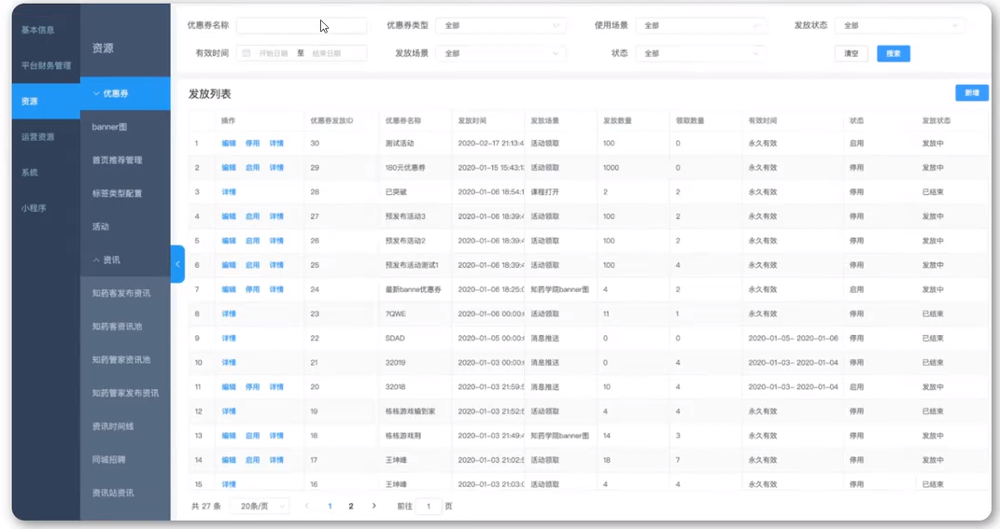
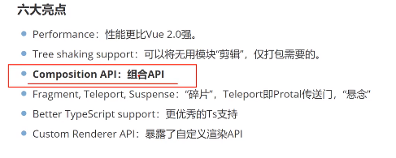
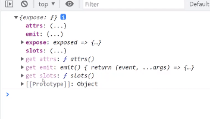
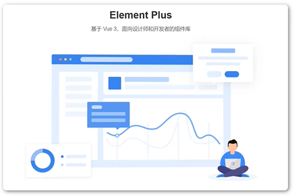
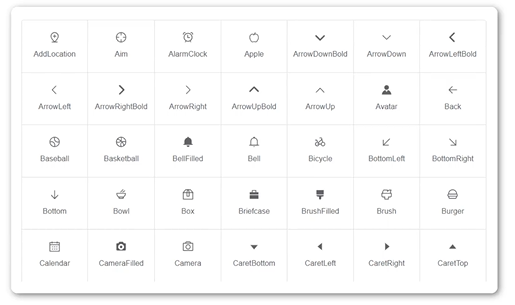

# Vue简介_3
# Vue引入第三方

# Axios网络请求

# Axios网络请求封装

# 网络请求跨域解决方案

JS采取的是同源策略

同源策略是浏览器的一项**安全策略**，浏览器只允许js代码请求和当前所在服务器域名，端口，协议相同的数据接口上的数据，这就是同源策略

也就是说，当协议，域名，端口任意一个不相同时，都会产生跨域问题，所以要如何解决跨域问题

## 跨域错误提示信息


## 目前主流的跨域解决方案有两种：

1. 后台解决：cors
2. 前台解决：proxy

```js
devServer:{
	proxy:{
		'/api':{
			target:'<url>',
               changeOrigin:true
		}
	}
}
```

> 配置好跨域之后，一定要重启一下服务器才行！

# Vue引入路由配置

**页面关系管理**

在vue中，跨域通过`vue-router`路由管理页面之间的关系

Vue Router时Vue.js的官方路由，它与Vue.js核心深度集成，让用Vue.js构建单页应用变得轻而易举


## Vue 中引入路由

第一步：安装路由 `npm install --save vue-router`

`pnpm add vue-router@4`

第二步：配置独立的路由文件

```js
import {createRouter,createWebHashHistory,createWebHistory} from 'vue-router'
import Home from '../views/homeView.vue'
const routes=[
    {
        path:'/',
        name:'home',
        component:Home
    },
    {
        path:'/about',
        name:'about',
        component:()=>import("../views/aboutView.vue")
    }
]
const router=createRouter({
    /**
     * createWebHashHistory
     *      home：http://127.0.0.1:5173/#/
     *      about：http://127.0.0.1:5173/#/about
     * 原理：a标签锚点连接
     */
    /**
     * createWebHistory
     *      home：http://127.0.0.1:5173/
     *      about：http://127.0.0.1:5173/about
     * 此种方式，需要后台配置做重定向，否则会出现404问题
     * 原理：HTML5 的pushState()
     */
    history:createWebHashHistory(),
    routes
})

export default router;
```

第三步：引入路由到项目

```js
//main.js
import router from './router'
app.use(router)
```

第四步：指定路由显示入口`<router-view>`

第五步：指定路由跳转

```vue
<router-link to="/">Home</router-link>
<router-link to="/about">About</router-link>
```

# 路由传递参数

**页面跳转过程中，是可以携带参数的**，很常见的业务

例如：在一个列表项，点击进入查看每个列表项的详情

**没有传递参数的数量限制**：在`path:'/list/:name/:key'`

第一步：在路由配置中指定参数的`key`

```js
{
	path:'/list/:name',
    name:'list',
    component:()=>import('../biews/ListView.vue')
}
```

第二步：在跳转过程中携带参数

**参数值填写多个**

```vue
    <ul>
        <li><RouterLink to="/newDetail/百度">百度新闻</RouterLink></li>
        <li><RouterLink to="/newDetail/腾讯">腾讯新闻</RouterLink></li>
        <li><RouterLink to="/newDetail/头条">头条新闻</RouterLink></li>
    </ul>
```

第三步：在详情页面读取路由携带的参数

```vue
<p>{{ $route.params.name }}</p>
```


# 嵌套路由的配置



路由嵌套是非常常见的需求

第一步：创建子路由要加载显示的页面

第二部：在路由配置文件中添加子路由配置

```js
{
	path:'/news',
    name:'news',
	redirect:'/news/baidu',
    component:()=>import('../views/NewsView.vue'),
    children:[
        {
			path:'baidu',
            component:()=>import('../views/NewsList/BaiduNews.vue')
        },
        {
            path:'wangyi',
            component:()=>import('../views/NewsList/WangyiNews.vue')
        }
    ]    
    
}
```

第三步：指定子路由显示位置`<router-view></router-view>`

第四步：添加子路由跳转链接

```vue
<router-link to="/news/baidu">百度新闻</router-link>
<router-link to="/news/wangyi">网易新闻</router-link>
```

第五步：重定向配置`redirect:"/news/baidu"`

```js
 {
      path: '/about',
      name: 'about',
      //重定向
      redirect:'/about/us',
      component: () => import('../views/AboutView.vue'),
      children:[
        {
          path:'us',
          name:'us',
          component:()=>import('../views/AboutSub/Aboutus.vue'),
        },
        {
          path:'info',
          name:'info',
          component:()=>import('../views/AboutSub/Aboutinfo.vue')
        }
      ]
    }
```

```vue
<template>
  <div class="about">
    <h3>关于</h3>
    <RouterLink to="/about/us">关于我们</RouterLink>
    <RouterLink to="/about/info">关于信息</RouterLink>
    <RouterView></RouterView>
  </div>
</template>
```

```vue
<template>
    <h3>关于我们</h3>
</template>
```

```vue
<template>
    <h3>关于信息</h3>
</template>
```

# Vue状态管理(Vuex)

组件与组件之间的数据管理

vuex是专为vue.js应用程序开发的状态管理模式+库。它采用集中式存储管理应用的所有组件的状态，并以相应的规则保证状态以一种可预测的方式发生变化。

**简单来说，状态管理可以理解成为了更方便管理组件之间的数据交换，提供了一个集中式的管理方案，任何组件都可以按照指定方式进行读取和改变数据**


## 引入Vuex的步骤

第一步：安装Vuex`npm install --save vuex`

第二步：配置Vuex文件

```js
import {createStore} from 'vuex'

export default createStore({
	state:{
		counter:0
    }
})
```

第三步：在主页面中引入Vuex

```js
import store from './store'
app.use(store)
```

第四步：在组件中读取状态

```vue
<p>
    counter:{{$store.state.counter}}
</p>
//或者
//一个组件读取多次可以如下
import {mapState} from 'vuex'
computed:{
	
}
```


# Vue状态管理核心(Vuex)

操作Vuex状态

常用的核心概念包含：`State`，`Getter`，`Multation`，`Action`

State 全局数据

## Getter

对vuex中的数据进行过滤

```js
import {createStore} from 'vuex'
export default createStore{
	state:{
		counter:0
    },
    getters:{
		getCount(state){
			return state.counter>0?state.counter:"数据不符合要求"
        }
    }
}
```

```vue
import {mapState,mapGetters} from 'vuex'
computed:{
	...mapGetters(['getCount'])
}
//或者
<p>
    counter:{{$store.state.counter}}
</p>
```

## Mutation（变异，改变）

更改Vuex的store中的状态唯一方法是提交mutation。Vuex中的mutation非常类似于事件：每个mutation都有一个字符串的事件类型(type)和一个回调函数(handler)。这个回调函数就是我们实际进行状态更改的地方，并且它会接受state作为第一个参数 

```js
import {createStore} from 'vuex'

export default createStore({
	state:{
		counter:0
    },
    getters:{
		
    },
    mutations:{
		setCounter(state,num){
			state.counter+=num
        }
    }
})
```


这样也可以


## Action

Action类似于mutation，不同于：

1. Action提交的是mutation，而不是直接变更状态
2. Action可以包含任意异步操作

```js
import {createStore} from 'vuex'
import axios from 'axios'
export default{
	state:{
		counter:0
    },
    getters:{
        getCount(state){
			return state.counter>0?state.counter:"数据不符合要求"
        }
    }
}
```


```js
 mutations:{
        addCounter(state,num){
            state.counter+=num;
        }
    },
    //actions为异步做准备的
    actions:{
        //({对象结构赋值})
        asyncAddCounter({commit}){
            axios.get("http://iwenwiki.com/api/generator/list.php")
            .then(res=>{
                commit("addCounter",res.data[0])
            })
        }   
    }
```

在调用时：

```js
import {mapMutations,mapActions} from 'vuex';

methods:{
    ...mapActions(['asyncAddCounter']),
    addClickHandleAsync(){
      this.asyncAddCounter()
    }
  }
//或者
methods:{
    addClickHandleAsync(){
		this.$store.dispatch("asyncAddCounter");
    }
}
```

# Vue3新特性1



## ref或者reactive

在2.x中通过组件data的方法来定义一些当前组件的数据

```js
data(){
	return{
		name:"iwen",
        list:[],
    }
}
```

在3.x中通过ref或者reactive创建响应式对象

```js
import {ref,reactive} from 'vue'
export default{
	setup(){
		const name=ref("iwen")
        const state=reactive({
			list:[]
        })
        return{
			name,
            state
        }
    }
}
```

ref常用于创建简单对象

reactive常用于创建复杂对象

也可以这样我看官方文档是这样不用return

**Vue3 官方提供了 script setup 语法糖 只需要在 script 标签中添加 setup ，组件只需引入不用注册，属性和方法也不用返回**

```js
<script setup>
import {ref,reactive} from 'vue'
const message=ref("我是消息")
const names=reactive({
  list:["iwen","ime","frank"]
})
function clickHandle(){
  console.log("点击了")
  message.value="改变了"
}
</script>

<template>
  <div class="greetings">
     <p>{{ message }}</p>
     <ul>
      <li v-for="(item,index) of names.list" :key="index">{{ item }}</li>
     </ul>
     <button @click="clickHandle">按钮</button>
  </div>
</template>
```


setup()中使用props（组件传递数据）和context（组件当前对象）

在2.x中，组件的方法中可以通过this获取当前组件的实例，并执行data变量的修改，方法的调用，组件的通信等等。但在3.x中，setup()在beforeCreate和created时就已经调用，无法与2.x一样使用this，但可以通过接受setup(props,ctx)的方法，获取到当前组件的实例和props

```js
export default {
    props:{
        name:String
    },
    setup(props,ctx){
		console.log(props.name)
        ctx.emit("event")
    }
}
```

setup无this可以使用ctx



# Vue3新特性2

**在setup中使用生命周期函数**

可以通过在生命周期钩子前面加上'on'来访问组件的生命周期钩子


```vue
<script >
import { onMounted } from 'vue';
export default {
  name:'HelloWorld',
  setup(){
    //比以前有优势，以前同一个生命周期函数只能存在一个，现在可以存在多个
    onMounted(()=>{
      console.log("生命周期函数1：onMounted");
    })
    onMounted(()=>{
      console.log("生命周期函数2：onMounted");
    })
  }
}
</script>
```

## provide/Inject

1. provide()和inject()可以实现嵌套组件之间的数据传递
2. 这两个函数只能在setup()函数中使用
3. 父级组件中使用provide()函数向下传递数据
4. 子级组件使用inject()获取上层传递过来的数据
5. 不限层级

```js
import HelloWorld from './components/HelloWorld.vue'
import { provide } from 'vue';
export default {
  components:{
    HelloWorld
  },
  setup(){
    provide("message","我是消息")
  }
}
```

```js
import {inject } from 'vue';
const message=inject("message")
    return {
      message
    }
```

> 跨组件传递数据只能从上到下但是不能从下到上

## Fragment

Fragment：碎片

不再限于模板中的单个根节点

```vue
<template>
	
	<HelloWorld msg="Wlecome to Your Vue.js App"/>
</template>
```

```vue
<div class="greetings">
    <p>HelloWorld</p>
    <p>{{ message }}</p>
  </div>
```

> 以前写DOM时只能先在外面写个div后再写入其他标签，现在没有限制

# Vue3加载Element-plus



Element-plus一套桌面端组件库

## 安装Element-Plus

```js
$ npm install element-plus --save

# Yarn
$ yarn add element-plus

# pnpm
$ pnpm install element-plus
```

## 完整引用

大小不在意

```js
import {createApp} from 'vue'
import ElementPlus from 'element-plus'
import 'element-plus/dist/index.css'
import App from './App.vue'

const app=createApp(App)
app.use(ElementPlus)
app.mount('#app')
```

## 按需导入

首先需要安装 `unplugin-vue-components`和`unplugin-auto-import`这两款插件

```js
npm install -D unplugin-vue-components unplugin-auto-import 
```

然后修改配置文件

```js
const {defineConfig}=require('@vue/cli-service')
const AutoImport = require('unplugin-auto-import/webpack')
const Components = require('unplugin-vue-components/webpack')
const { ElementPlusResolver } = require('unplugin-vue-components/resolvers')

module.exports = {
    configureWebpack: {
      plugins: [
        AutoImport({
          resolvers: [ElementPlusResolver()],
        }),
        Components({
          resolvers: [ElementPlusResolver()],
        }),
      ],
    }
```

最后，可以直接在组件中使用

```vue
<template>
	<el-button>Default</el-button>
	<el-button type="primary">Primary</el-button>
</template>
```

# Vue3加载ELement-plus的字体图标



`Elmenet-plus`同时还提供了图标

## 安装`Icons`字体图标

```js
# NPM
$ npm install @element-plus/icons-vue
# Yarn
$ yarn add @element-plus/icons-vue
# pnpm
$ pnpm install @element-plus/icons-vue
```

### 全局注册

在项目根目录下，创建`plugins`文件夹，在文件夹下创建文件icons.js文件

```js
import * as components from '@element-plus/icons-vue'
export default {
	install:(app)=>{
		for (const key in components){
			const componentConfig=component[key];
            app.component(componentConfig.name,componentConfig)
        }
    }
}


```

> 如果你是 Vue3 + Vite ，只需要在 vite.config.js 中做如下配置即可：js复制代码// vite.config.js

```js
import Icons from 'unplugin-icons/vite'

export default defineConfig({
  plugins: [
    Icons({ compiler: 'vue3' }),
  ],
})
```

### 引入文件

在`main.js`中引入icons.js文件

```js
import elementIcon from './plugins/icons';
app.use(elementIcon)
```

### 使用方式

直接在组件中引入使用

```vue
<el-icon class="expand" color="#409EFC" :SIZE=“3>
	<expand/>
</el-icon>
```


