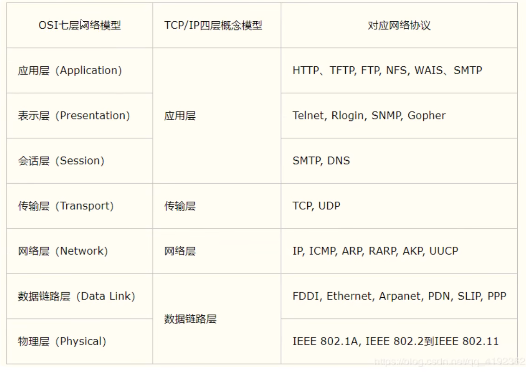

# 网络编程

## 1.1、概述

打电话 --连接 -接了 --通话    TCP

发短信 --发送就完事 --接受    UDP

**计算机网络：***

计算机网络是指将==地理位置不同==的具有独立功能的==多台计算机及其外部设备，通过通信路线连接起来==，在网络操作系统、网络管理软件及==网络通信协议==的管理和协调下，==实现资源共享和信息传递==的计算机系统


**网络编程的目的：**

- 传播交流信息，数据交换，通信


**想要达到这个效果需要什么**

1. 如何准确的定位网络上的一台主机  192.168.3.124:端口，定位到这个计算机上的某个资源
2. 找到了这个主机，如何传输数据？

javaweb：网页编程  B/S

网络编程：TCP/IP   C/S

## 1.2、网络通信的要素

如何实现网络的通信？

通信双方地址：

- ip 
- 端口号
- 192.168.16.124:5900

**规则：网络通信协议**

TCP/IP参考模型



小结：

1. 网络编程中有两个主要问题
   - 如何准确的定位到网络上的一台或者多台主机：主机IP地址/域名
   - 找到主机之后如何进行通信

2. 网络编程中的要素
   - IP和端口号   	了解IP类
   - 网络通信协议   	udp tcp协议

3. 万物皆对象

## 1.3、IP

ip地址：InetAddress

- 唯一定义一台网络上计算机

- 127.0.0.1：本机localhost

- ip地址分类

  - ip地址的分类：ipv4/ipv6

    - IPV4：127.0.0.1，4个字节组成，0-255，42亿

    - IPV6：fe80::915d:470e:d522:4339%16，128位8个无符号整数

    - ```
      2001：0bb2：aaaa：0000：1aaa：1312
      ```

  - 公网（互联网）-私网（局域网）

    - 192.168.xx.xx，专门给组织内部使用的

 - 域名：记忆IP问题！

```java
package com.xiaoke.lesson;
import java.net.InetAddress;
import java.net.UnknownHostException;
//测试IP
public class TestInetAddress {
    public static void main(String[] args) {
        try {
            //查询本机地址
            InetAddress inetAddress1= InetAddress.getByName("127.0.0.1");
            System.out.println(inetAddress1);
            InetAddress inetAddress3= InetAddress.getByName("localhost");
            System.out.println(inetAddress3);
            InetAddress inetAddress4= InetAddress.getLocalHost();
            System.out.println(inetAddress4);

            //查询网站ip地址
            InetAddress inetAddress2= InetAddress.getByName("www.baidu.com");
            System.out.println(inetAddress2);

            //常用方法
            //System.out.println(inetAddress2.getAddress());
            System.out.println(inetAddress2.getCanonicalHostName());//规范的名字
            System.out.println(inetAddress2.getHostAddress());//ip
            System.out.println(inetAddress2.getHostName());//域名或自己电脑的名字
        } catch (UnknownHostException e) {
            throw new RuntimeException(e);
        }
    }
}

```

## 1.4、端口

端口表示计算机上的一个程序进程

- 不同的进程有不同的端口号！用来区分软件（ip区分地址定位）

- 端口被规定0~65535

- TCP,UDP：65535*2  tcp:80 ,upd:80单个协议下，端口号不能冲突

- 端口分类

  - 共有端口：0~1023
    - HTTP：80
    - HTTPS：443
    - FTP：21
    - Telent：23

    - 程序注册端口：1024~49151，分配用户或者程序
      - Tomcat：8080
      - MySQL：3306
      - Oracle：1521

   - 动态、私有：49152~65535

     ```bash
     netstat -ano #查看所有的端口
     netstat -ano|findstr "5900"   #|管道过滤，先查后面再带入前面····该命令是查看指定的端口
     tasklist|findstr "8696" #查看指定端口的进程
     ```

```java
package com.xiaoke.lesson;

import java.net.InetSocketAddress;

public class TestInetSocketAddress {
    public static void main(String[] args) {
        //构造端口
        InetSocketAddress socketAddress= new InetSocketAddress("127.0.0.1",8080);
        InetSocketAddress socketAddress2= new InetSocketAddress("localhost",8080);
        System.out.println(socketAddress);
        System.out.println(socketAddress2);

        System.out.println(socketAddress.getAddress());//返回byte数组形式的IP地址
        System.out.println(socketAddress.getHostName());//用来得到主机的IP地址
        System.out.println(socketAddress.getPort());//端口
    }
}

```


## 1.5、通信协议

协议：约定，就好比说的普通话

**网络通信协议：**速率，传输码率，代码结构，传输控制...

**问题**：非常复杂

大事化小：分层！

**TCP/IP协议簇：实际上是一组协议**

重要：

- TCP： 用户传输协议
- UDP：用户数据报协议

出名的协议：

- TCP：
- IP:     网络互联协议

**TCP UDP 对比**

TCP：打电话

- 连接，稳定

- `三次握手` `四次挥手`

  ```
  最少需要三次，保证稳定连接
  A：你愁啥？
  B：瞅你咋地
  A：干一场
  
  
  A：我要走了！
  B：你真的要走了？
  B：你真的真的要走了？
  A：我真的要走了！
  ```

- 客户端，服务端
- 传输完成，释放连接，效率低

UDP：发短信

- 不连接，不稳定
- 客户端，服务端：没有明确的界限
- 不管有没有准备号，都可以发给你
- 例如：导弹
- 例如：DDOS：洪水攻击

## 1.6、TCP

管道的概念


客户端输出流，到管道输入流，管道输出流，服务端输入流

客户端

1. 连接服务器Socket
2. 发送消息

```java
package com.xiaoke.lesson02;
import java.io.IOException;
import java.io.OutputStream;
import java.net.InetAddress;
import java.net.Socket;

//客户端
public class TcpClientDemo01 {
    public static void main(String[] args) {
        Socket socket=null;
        OutputStream os=null;
        try {
            //1. 要知道服务器的地址和端口号
            InetAddress serverIP=InetAddress.getByName("127.0.0.1");
            int port=8111;
            //2. 创建一个socket连接
            socket=new Socket(serverIP,port);
            //3. 发送消息 IO流
            os=socket.getOutputStream();
            os.write("你好，跟着狂神说学java".getBytes());
        } catch (Exception e) {
            e.printStackTrace();
        }finally {
            if (os!=null){
                try {
                    os.close();
                } catch (IOException e) {
                    throw new RuntimeException(e);
                }
            }
            if (socket!=null){
                try {
                    socket.close();
                } catch (IOException e) {
                    throw new RuntimeException(e);
                }
            }
        }
    }
}

```

服务器

1. 建立服务的端口 ServerSocket
2. 等待用户的连接 accept
3. 接受用户的信息

```java
package com.xiaoke.lesson02;
import java.io.ByteArrayOutputStream;
import java.io.IOException;
import java.io.InputStream;
import java.net.ServerSocket;
import java.net.Socket;

//服务端
public class TcpServerDemo01 {
    public static void main(String[] args) {
        ServerSocket serverSocket =null;
        Socket socket =null;
        InputStream is =null;
        ByteArrayOutputStream baos=null;
        try {
            //1. 建立服务的端口
            serverSocket = new ServerSocket(8111);
            //2. 等待客户端连接过来
            socket = serverSocket.accept();
            //3. 读取客户端的消息
            is = socket.getInputStream();
            // 管道流
            /*
             * byte[] buffer=new byte[1024];
             * int len;
             * while((len=is.read(buffer))!=-1){
             *   String msg=new String(buffer,0,len);
             *   System.out.println(msg);
             * }
             * */

            baos=new ByteArrayOutputStream();
            byte[] buffer=new byte[1024];
            int len;
            while((len=is.read(buffer))!=-1){
                baos.write(buffer,0,len);
            }
            System.out.println(baos.toString());
        } catch (IOException e) {
            throw new RuntimeException(e);
        }finally {
            if (baos!=null){
                try {
                    baos.close();
                } catch (IOException e) {
                    throw new RuntimeException(e);
                }
            }
            if (is!=null){
                try {
                    is.close();
                } catch (IOException e) {
                    throw new RuntimeException(e);
                }
            }
            if (socket!=null){
                try {
                    socket.close();
                } catch (IOException e) {
                    throw new RuntimeException(e);
                }
            }
            if (serverSocket!=null){
                try {
                    serverSocket.close();
                } catch (IOException e) {
                    throw new RuntimeException(e);
                }
            }
        }
    }
}

```

###  文件上传

TcpClientDemo

```java
package com.xiaoke.lesson02;
import java.io.*;
import java.net.InetAddress;
import java.net.Socket;
import java.util.EnumMap;

public class TcpClientDemo02 {
    public static void main(String[] args) {
        Socket socket=null;
        OutputStream os= null;
        FileInputStream fis =null;
        ByteArrayOutputStream baos=null ;
        InputStream inputStream=null;
        try {
            //1. 创建一个Socket连接
            socket=new Socket(InetAddress.getByName("127.0.0.1"),8111);
            //2. 创建输出流
            os=socket.getOutputStream();
            //3. 文件流--读取文件
            fis = new FileInputStream(new File("test.png"));
            //4. 写出文件
            byte[] buffer = new byte[1024];
            int len=0;
            while((len=fis.read(buffer))!=-1){
                os.write(buffer,0,len);
            }

            //5. 告诉服务器已经传输完毕！
            socket.shutdownOutput();
            //6. 确定服务器接收完毕，才能断开连接
            inputStream=socket.getInputStream();
            baos=new ByteArrayOutputStream();
            int len2;
            byte[] buffer1=new byte[1024];
            while((len2=inputStream.read(buffer1))!=-1){
                baos.write(buffer1,0,len2);
            }
            System.out.println(baos.toString());

        } catch (IOException e) {
            throw new RuntimeException(e);
        }finally {
            if (baos!=null){
                try {
                    baos.close();
                } catch (IOException e) {
                    throw new RuntimeException(e);
                }
            }
            if (inputStream!=null){
                try {
                    inputStream.close();
                } catch (IOException e) {
                    throw new RuntimeException(e);
                }
            }
            if (fis!=null){
                try {
                    fis.close();
                } catch (IOException e) {
                    throw new RuntimeException(e);
                }
            }
            if (socket!=null){
                try {
                    socket.close();
                } catch (IOException e) {
                    throw new RuntimeException(e);
                }
            }
            if (os!=null){
                try {
                    os.close();
                } catch (IOException e) {
                    throw new RuntimeException(e);
                }
            }
        }

    }
}
```

TcpServerDemo

```java
package com.xiaoke.lesson02;

import java.io.*;
import java.net.ServerSocket;
import java.net.Socket;

public class TcpServerDemo02 {
    public static void main(String[] args) throws IOException {
        //1. 创建服务端口
        ServerSocket serverSocket = new ServerSocket(8111);
        //2. 监听客户端的连接
        Socket socket=serverSocket.accept();//阻塞式监听，会一直等待客户端连接
        //3. 获取输入流
        InputStream is = socket.getInputStream();
        //4. 文件输出
        FileOutputStream fos = new FileOutputStream(new File("receive.png"));
        int len;
        byte[] buffer = new byte[1024];
        while((len=is.read(buffer))!=-1){
            fos.write(buffer,0,len);
        }
        //5. 通知客户端接受完毕
        OutputStream os=socket.getOutputStream();
        os.write("已经接收完毕".getBytes());

        //关闭资源
        fos.close();
        is.close();
        socket.close();
        serverSocket.close();
    }
}
```

### Tomcat

服务端

- 自定义 S
- Tomcat服务器 S ：java后台开发

客户端

- 自定义 C
- 浏览器 B

## 1.7、UDP

udp没有服务端和客户端之分

发短信：不用连接，需要知道对方的地址！

---

java类：`DatagramPacket`

java类：`DatagramSocket`

发送消息

发送端:

```java
import java.io.ByteArrayOutputStream;
import java.net.DatagramPacket;
import java.net.DatagramSocket;
import java.net.InetAddress;
import java.net.SocketException;

//不需要连接服务器
public class UdpClientDemo01 {
    public static void main(String[] args) throws Exception {
        //1. 建立一个Socket--通信
        DatagramSocket socket = new DatagramSocket();
        //2. 建立包
        String msg="你好啊，服务器！";
        //发送给谁
        InetAddress localhost=InetAddress.getByName("localhost");
        int port=8080;
        //数据，数据的起始，要发送给谁
        DatagramPacket packet = new DatagramPacket(msg.getBytes(),0,msg.getBytes().length,localhost,port);
        //3. 发送包
        socket.send(packet);

        //4.关闭资源
        socket.close();
    }
}

```

接收端:

```java
package com.xiaoke.lesson03;

import java.net.DatagramPacket;
import java.net.DatagramSocket;

//等待客户端的连接
public class UdpServerDemo01 {
    public static void main(String[] args) throws Exception {
        //开放端口
        DatagramSocket socket=new DatagramSocket(8080);
        //接收数据
        byte[] buffer = new byte[1024];
        DatagramPacket packet = new DatagramPacket(buffer, 0, buffer.length);

        socket.receive(packet);//阻塞接收
        System.out.println(new String(packet.getData(),0,packet.getLength()));

        //关闭连接
        socket.close();
    }
}

```

### 循环发送消息

```java
package com.xiaoke.chat;

import java.io.BufferedReader;
import java.io.InputStreamReader;
import java.net.DatagramPacket;
import java.net.DatagramSocket;
import java.net.InetSocketAddress;


public class UdpSenderDemo01 {
    public static void main(String[] args) throws Exception {
        //1. 建立socket连接
        DatagramSocket socket=new DatagramSocket(9999);
        //2. 准备数据:控制台读取数据 System.in
        while(true){
            BufferedReader reader = new BufferedReader(new InputStreamReader(System.in));
            String data=reader.readLine();
            byte[] datas=data.getBytes();

            //3. 建立包
            DatagramPacket packet=new DatagramPacket(datas,0,datas.length,new InetSocketAddress("localhost",8888));

            //4. 发送包
            socket.send(packet);
            if (data.equals("bye")) break;
        }
        //关闭连接
        socket.close();

    }
}
```

```java
package com.xiaoke.chat;


import java.net.DatagramPacket;
import java.net.DatagramSocket;


//实现两个客户端之间消息的发送
public class UdpReceiveDemo01 {
    public static void main(String[] args) throws Exception {
        //1. 建立socket连接
        DatagramSocket socket=new DatagramSocket(8888);
        while (true){
            //2. 准备接收包裹
            byte[] container=new byte[1024];
            DatagramPacket packet=new DatagramPacket(container,0,container.length);
            //3. 接收数据
            socket.receive(packet);//阻塞式接收包裹
            String receiveData=new String(packet.getData(),0,packet.getLength());
            System.out.println(receiveData);
            if (receiveData.equals("bye")) break;

        }
        socket.close();
    }
}

```

**在线咨询:两个人都可以是发送方,也可以是接收方**

多线程:继承Runnable接口

发送端:

```java
package com.xiaoke.chat;

import java.io.BufferedReader;
import java.io.InputStreamReader;
import java.net.DatagramPacket;
import java.net.DatagramSocket;
import java.net.InetSocketAddress;
import java.net.SocketException;

public class TalkSend implements Runnable {
    DatagramSocket socket=null;
    BufferedReader reader =null;
    private String toIP;
    private int toPort;
    private int fromPort;
    public  TalkSend(int fromPort,int toPort,String toIP) {
        this.fromPort=fromPort;
        this.toIP=toIP;
        this.toPort=toPort;
        //1. 建立socket连接
        try {
            socket=new DatagramSocket(fromPort);
        } catch (SocketException e) {
            throw new RuntimeException(e);
        }
        //2. 准备数据:控制台读取数据 System.in
        reader = new BufferedReader(new InputStreamReader(System.in));
    }
    @Override
    public void run() {
       try{
           while(true){
               String data=reader.readLine();
               byte[] datas=data.getBytes();
               //3. 建立包
               DatagramPacket packet=new DatagramPacket(datas,0,datas.length,new InetSocketAddress(this.toIP,this.toPort));
               //4. 发送包
               socket.send(packet);
               if (data.equals("bye")) break;
           }
           //关闭连接
           socket.close();
       }catch (Exception e) {
           e.printStackTrace();
       }

    }
}


```

接收端:

```java
package com.xiaoke.chat;

import java.io.IOException;
import java.net.DatagramPacket;
import java.net.DatagramSocket;
import java.net.SocketException;

public class TalkReceive implements Runnable {
    DatagramSocket socket=null;
    private int receivePort;
    private String msgFrom;
    public TalkReceive(int receivePort,String msgFrom){
        this.receivePort=receivePort;

        try {
            socket=new DatagramSocket(receivePort);
        } catch (SocketException e) {
            throw new RuntimeException(e);
        }
        this.msgFrom=msgFrom;
    }

    @Override
    public void run() {
        //1. 建立socket连接

        while (true){
            //2. 准备接收包裹
            byte[] container=new byte[1024];
            DatagramPacket packet=new DatagramPacket(container,0,container.length);
            //3. 接收数据
            try {
                socket.receive(packet);//阻塞式接收包裹
            } catch (IOException e) {
                throw new RuntimeException(e);
            }
            String receiveData=new String(packet.getData(),0,packet.getLength());
            System.out.println(this.msgFrom+"："+receiveData);
            if (receiveData.equals("bye")) break;

        }
        socket.close();
    }
}

```

Student

```java
package com.xiaoke.chat;

public class TalkStudent {
    public static void main(String[] args) {
        //开启两个线程
        new Thread(new TalkSend(7777,9999,"localhost")).start();
        new Thread(new TalkReceive(8888,"老师")).start();
    }
}
```

Teacher

```java
package com.xiaoke.chat;

public class TalkTeacher {
    public static void main(String[] args) {
        //开启两个线程
        new Thread(new TalkSend(5555,8888,"localhost")).start();
        new Thread(new TalkReceive(9999,"学生")).start();
    }
}

```


**什么时候用什么方法呢？**

> new String（）一般使用字符转码的时候,byte[]数组的时候
> toString（）将对象打印的时候使用 

## 1.8、URL

https://www.baidu.com

同意资源定位符：定位资源的，定位互联网上的某一个资源

DNS域名解析	www.baidu.com    xxx.xx.xxx.xxx

> 协议：//ip地址：端口/项目名/资源