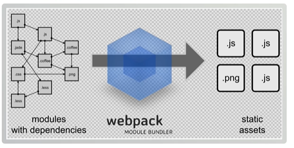

# 大前端

# Node js


```js
const http=require('http');
http.createServer(function(request,response){
    //1. 创建一个httpserver服务
    //浏览器怎么认识hello server
    response.writeHead(200,{'Context-type':'text/plain'});
    //这句话的意思是：告诉浏览器将以text-plain去解析
    //plain就是以什么方式输出。text/html 以html来进行解析
    //hello server 这段数据
    //给浏览器输出内容
    response.end("<strong>hello server!!!</strong>");

}).listen(8888);
console.log("已启动服务是：http://localhost:8888")
//2. 监听一端口：8888
//3. 启动运行服务 node httpserver.js
//4. 在浏览器访问http://localhost:8888
```

Node-操作MYSQL数据库

1. 安装mysql依赖

   ```js
   npm install mysql
   ```

2. 定义dlb.js进行操作

```js
var mysql =require('mysql')
var connection=mysql.createConnection({
	host:"localhost",
    user:"me",
    password:"secret",
    database:"my_db"
});
connection.connect();
coonnection.query('SQL语句',function(error,results,fields){
	if(error) throw error;
    console.log("The solution is:",results[0].solution);
})


```

```js
//1. 导入mysql依赖包 mysql数据第三方的模块就类似于java.sql
const { log } = require("console");
var mysql=require("mysql")
const { createConnection } = require("net")
//1：创建一个mysql的connection对象
//2：配置数据连接的信息
var connection= mysql.createConnection({
    host:"127.0.0.1",
    port:3306,
    user:"root",
    password:"123456",
    database:"testdb"
})
//3：开辟连接
connection.connect();
//4：执行curd...增删改查
connection.query("select * from kss_user",function(error,results,fields){
    //查询失败，直接抛出错误
    if(error)throw error;
    //查询成功
    console.log("results=",results);
})
//5：关闭连接
connection.end();
//最后一步运行node db.js查看结果
```

> node 导入包使用 require

# Es6(ECMScript)

用来指定JavaScript语法

## let和const命令

```js
 // 传统定义变量和常量的方式 统一使用var
        var name="iwen";
        var link="www.baidu.com";
        var PI=Math.PI;
        console.log(name);
        console.log(link);
        console.log(PI);
        //ES6定义的方式
        //变量
        let name2="frank";
        let link2="www.qq.com";
        //常量
        const PI2=Math.PI;

        console.log(name2);
        console.log(link2);
        console.log(PI2);

        //区别
        //let 和const解决
        //1.var的变量穿透问题
        //2.常量修改的问题
        for (var i=0;i<5;i++){
            console.log(i);
        }
        //这里就造成变量穿透
        console.log(i);  
        //用let代替就行

        //常量但是可以修改
        var PI3=Math.PI;
        PI=100;
        console.log(PI3);
        //所有使用const
        //const PI3=Math.PI;

        //小程序，uniapp或脚手架中可以大量使用let和const
        //web开发还是使用var
```

## 模板字符串

以前：使用''或者""来吧字符串套起来

现在：``【反引号】

```js
 //字符串会牵涉到动态部分
        var person={
            name:"i",
            address:"is",
            link:"message"
        }
        let address1="我是消息"+"test"+person.name+"test"+person.address+person.link;
        console.log(address1);

        //es6的语法模板字符串
        let address2=`ES6--我是消息test${person.name},${person.address},${person.link}`;
        console.log(address2);
```

## 函数默认参数与箭头函数

 ### 函数默认参数

```js
//函数默认值
        function sum(a,b){
            return a+b;
        }
        var result=sum(1,2);
        console.log(result);
        //没有传递参数计算出来时Nan
        //因为没有传递值的话默认传递的时undefined
        //所以可以写默认参数
        // function sum(a=100,b=200){
        //    return a+b;
        //}
```

### 箭头函数

```js
//箭头函数-重点
        var sum=function(a,b){
            return a+b;
        }
        //箭头函数 - 改进1
        var sum=(a,b)=>{
            return a+b;
        }
        //箭头函数 - 改进2
        var sum=(a,b)=>a+b;

        //规律
        //1. 去掉function
        //2. 在括号后面加箭头
        //3. 逻辑代码中仅有return可以直接省去（如果不止return就不能省略）
        //4. 如果参数只有一个，可以把括号也省去（多个参数就不能省去）
```

## 对象初始化简化

> 它是指：如果一个对象中的key和value的名字一样的情况下可以定义成一个

```js
 let info1={
            title:"xiaoke",
            link:"www.baidu.com",
            go:function(){
                console.log("在家学es6语法")
            }
        }
        //es6简写语法
        //因为对象时key：value存在
        //1：如果key和变量的名字一致，可以只定一次即可
        //2：如果value时一个函数，可以把`:function`全部去掉剩下()即可
        let title="xiaoke";
        let link="www.baidu.com";
        let info2={
            title,
            link,
            go(){
                console.log("在家学es6语法")
            }
        }
```

>es6简写语法
>   因为对象时`key:value`存在
>   1：如果key和变量的名字一致，可以只定一次即可
>   2：如果value时一个函数，可以把`:function`全部去掉剩下()即可

## 对象结构

快捷获取对象属性和方法的方式

```js
//对象是key:value存在，获取对象属性和方法的方式由两种
        //1：通过.
        //2：通过[]
        var title="xiaoke";
        var link="www.baidu.com";
        let info2={
            title,
            link,
            go(){
                console.log("在家学es6语法")
            }
        }
        //1 通过.
        console.log(info2);
        console.log(info2.title);
        console.log(info2.link);
        info2.go();
        //2 通过[]
        console.log(info2["title"]);
        console.log(info2["link"]);
        info2["go"]();

        //es6对象结构 - 其实就是快速获取对象属性和方法的一种方式
        var {title,link,go} =info2;
        //还原代码
        //var title=info2.title;
        //var link=info2.link;
        console.log(title);
        console.log(link);
        go();
        //问题：为什么对象取值要提供两种方式。 .  一个[]
```

## 传播操作符

把一个对象的属性传播到另一个对象中

```js
 //对象传播操作符 ...
        var person = {
            name: "学相伴",
            address: "广东",
            link: "www.baidu.com",
            phone: 123456,
            go() {
                console.log("开始学习啦")
            }
        }
        //解构对象
        var { name, address, ...person2 } = person;
        console.log(name);
        console.log(address);
        console.log(person2);
```

小案例：

```js
//java ---后台
        // 数据格式：var userPage={pages:10,user:[{},{}],pageNo:1,pageSize:100,tital:100};
        //异步请求
        //$.post("/user/search",function(res){
        //    res={pages:10,user:[{},{}],pageNo:1,pageSize:100,tital:100};
        var userPage={pages:10,user:[{},{}],pageNo:1,pageSize:100,tital:100};
        var {user,...userPage2}=userPage;
        //})
```

## 数据map和reduce的使用方法

目标：数组中map方法的应用场景

讲解：数组中新增了map和reduce方法

### map()

该方法可以将原数组中的所有元素通过一个函数进行处理并放入到一个新数组中并返回该新数组

map(function())

**map --自带的循环，并且会把处理的值回填到对应的位置**

案例：

```js
 //要对arr数组每个元素*2
        let arr=[1,2,3,4,5,6,7];
        //传统做法
        let newarr=[];
        for(let i=0;i<arr.length;i++){
            newarr.push(arr[i]*2);
        }
        console.log(newarr);

        //map --自带的循环，并且会把处理的值回填到对应的位置
        var newarr2=arr.map(ele=>ele*2)
        console.log(newarr2)

        //map处理对象的数据
        var users=[{age:10,name:"小学"},{age:12,name:"小相"},{age:15,name:"小伴"}];
        var newusers=users.map(function(ele){
            ele.age+=1;
            ele.check=true;
            return ele;
        })
        console.log(newusers)
```

### reduce()

reduce(function(),初始值(可选))

接收一个函数(必须)和一个初始值(可选),该函数接收两个参数：

1. 第一个参数是上一次reduce处理的结果
2. 第二个参数是数组中要处理的下一个元素

​	reduce()会从左到右依次把数组中的元素用reduce处理，并把处理的结果作为下次reduce的第一个参数，如果是第一次，会把前两个元素作为计算参数或者把用户指定的初始值作为起始参数

> es6语法是可以在nodejs里面使用的 uniapp，微信小程序也是可以的使用es6语法

# NPM包管理器

NPM：Node Package Manage 是nodejs包管理工具，

1. 快速构建nodejs工程

   - npm init/npm init -y ：得到package.json找个文件

     ```js
     {
       "name": "npm",//项目名称
       "version": "1.0.0",//版本
       "description": "",//描述
       "main": "index.js",//入口js
       "scripts": {//运行脚本
         "test": "echo \"Error: no test specified\" && exit 1"
       },
       "author": "",//开发作者
       "license": "ISC"//授权协议
     }
     ```

   类似于：pox.xml文件作用管理依赖

2. 快速安装和依赖第三方模块，比如mysql，redis等等

```
//查看npm版本
npm -v
```

2：快速安装和依赖第三方模块

2-1：快速安装依赖第三方模块
	`npm install xxx 或 npm i xxx模块名称`

2-2：安装在什么地方

​	相同目录下会有一个`node_modules`文件夹

2-3：安装模块如何使用

​	`node：cosnt modules=require("模块名")`

2-4：模块和package.json有什么关系呢？

```js
"devDependencies": {
    "@vuepress/bundler-vite": "^2.0.0-rc.2",
    "vue": "^3.4.15",
    "vuepress": "2.0.0-rc.2",
    "vuepress-theme-hope": "2.0.0-rc.18"
  }
```

​	通过npm install xxx 会记录在package.js中，

​	类似于maven中pom.xml一个含义，**记录作用在于复用**

​	1.package.js记录依赖模块

​	2.通过npm install 可以直接把package.js所依赖的模块全部自动下载下来这样就可以避免重复下载模块，方便去集成第三方模块

​	3.为什么不直接拷贝：node_mdiles呢，当然可以

​	为什么不拷贝，因为：下载模块的依赖过多文件而且很大，混乱文件很多，

2-5：如果安装模块很慢怎么办

​	换成淘宝镜像

2-6：如何运行

​	`node 文件名.js  运行过程.js是可以省去的` 终止的命令：CTRL+C多次执行

2-7：如何下载多个

​	`npm install jquery vue redis mysql`

2-8：下载指定版本号

​	npm i redis@3.0.2

​	npm i xxx@版本号

​	不指定默认最新

2-9：如何卸载

​	`npm uninstall vue jquery`  ：卸载多个

# Babel

## 简介

ES6的某些高级语法在浏览器环境甚至是node.js环境无法执行

Babel是一个广泛使用的转码器，可以将ES6代码转为ES5代码，从而在现有环境执行

这意味着，可以用ES6编写程序，不用担心环境是否支持

## 安装

安装命令行转码工具

> Babel提供babel-cli工具，用于命令行转码，他的安装命令如下

```
npm install -g babel-cli
#查看是否安装成功
babel --version
```

## Babel的使用

1. 创建babel文件
2. 初始化项目

```
npm init -y
```

 	3. 创建文件src/example.js下面是一段ES6代码

```
//转码前
//定义数据
let input=[1,2,3]
//将数组的每个元素+1
input=input.map(item=>item+1)
console.log(input)
```

 	4. 配置.babelrc

> Babel的配置文件是babelrc，存放在项目的根目录下，该文件用来设置转码规则和插件，基本格式如下。

```js
{
    "presets":[],
    "plugins":[]
}
```

presets字段设置转码规则，将es2015规则加入.balbelrc：

```js
{
	"presets":["es2015"],
    "plugins":[]
}
```

 	5. 安装转码器，在项目中安装

```js
npm install --save-dev babel-preset-es2015
```

 	6. 转码

```js
# npm install --save-dev csv-loader xml-loader
#转码结果写入一个文件
mkdir dist1
# --out-file 或 -o 参数指定输出文件
babel src/example.js --out-file dist1/compiled.js
#或者
babel src/example.js --o dist1/compiled.js

#整个目录转码
mkdir dist2
# --out-dir 或 -d 参数指定输出目录
babel src --out dir dist2
#或者
babel src -d dist2
```


# 自定义脚本

1. 改写package.js

```js
{
	//...
    "scripts"{
		//...
        "build":"babel src/exmaple.js -o dist/example.js"
        //build这个只是一个名字，可以进行修改
    },    
}	
```

2. 转码的时候，执行下面的命令

```js
mkdir dist
npm run build
```

> 因为要输出到`dist`文件夹下所有要`mkdir dist` 创建出这个文件夹

# common js 模块化规范

**导出：**

```js
//工具类
const sum = function (a, b) {
    return a + b;
}
const sub = function (a, b) {
    return a - b;
}
const mul = function (a, b) {
    return a * b;
}
const di = function (a, b) {
    return a / b;
}
// 导出给别人使用
// module.exports={
//     sum:sum,
//     sub:sub,
//     mul:mul,
//     di:di
// }
module.exports = {
    sum,
    sub,
    mul,
    di
}
```

**导入使用：**

```js
//require
const m=require("./四则运算.js")
const n=require("./print.js")
//必须要导出了才可以使用
console.log(m.di(10,2));
n.print();

//common js 模块化开发  export  require   必须要导出了才可以使用
```

# ES6模块化规范

ES6使用export 和import 进行导出和导入模块

1. 默认情况下使用es6语法是无法运行，所以要进行使用Babel转码变为es2015

## ES6模块化写法1：

1. 创建 src/userAPI.js，导出模块

```JS
export function getList(){
    //在真是业务中，使用异步获取数据
    console.log("获取数据列表");
}

export function save(){
    //在真是业务中，使用异步获取数据
    console.log("保存数据");
}
```

2. 创建 src/userTest.js，导入模块

```js
import {save,getList} from "./userAPI"
//使用这个方式进行导入方法和依赖
getList();
save();
```

## ES6模块化写法2：

1. 创建 src/userAPI.js，导出模块

```JS
export default {
    getList() {

        console.log("获取数据列表");
    },
    save() {

        console.log("保存数据");
    }
}
```

2. 创建 src/userTest.js，导入模块

```JS
import user from "./userAPI"
//导出成一个对象
//使用这个方式进行导入方法和依赖
user.getList();
user.save();
```

导出后因为编译器是不支持es6语法所以要自己去babel转码一下

# Webpack

Webpack是一个前端资源加载/打包工具，他将根据模块的依赖关系进行静态分析，然后将这些模块按照指定的规则生成对应的静态资源

从图中可以看出，Webpack可以将多种静态资源js，css，less转换成一个静态文件，减少了页面请求



合并js加密压缩，css也可以进行压缩，提高浏览器访问速度

## Webpack安装

1. 全局安装

```js
npm install -g webpack webpack-cli
```

2. 安装后检查版本号

```js
webpack -v
```

## js打包

1. 创建webpack文件夹：nodejs项目

```js
npm init -y
```

2. 创建src文件夹

3. src下创建common.js

```JS
exports.info=function(str){
	document.write(str);
}
```

4. src下创建utils.js

```JS
exports.add=function(a,b){
	return a+b;
}
```

5. src下创建main.js（入口文件，就是模块集中进行引入）

```js
const common=require("./common");
const utils=require("./utils");

common.info("Hello world!"+utils.add(100,200));
```

1：创建一个nodejs项目   npm init -y

2：创建一个src目录

3：在src存放两个需要合并的util.js 和common.js

4：准备一个入口文件main.js，其实就是模块集中进行引入

//JS打包

5：在根目录下定义个webpack.config.js 文件配置打包的规则

6：执行webpack查看效果

**打包规则：**

```js
//导入path模块  nodejs内置模块
const path=require("path");//加载目录相关的东西
//定义JS打包规则
module.exports={
    //1. 入口函数从哪里开始进行编译打包
    entry:"./src/main.js",
    //2. 编译成功以后把内容输出到哪里去
    output:{
        //2-1. 定义输出的指定目录__dirname当前项目根目录，产生一个dist文件
        path:path.resolve(__dirname,"./dist"),
        //2-2. 合并的js文件存储在 dist/bundle.js 文件中
        filename:"bundle.js"
    }
}
```

## CSS打包

1. 安装style-loader和css-loader

>webpack本身只能处理JavaScript模块，如果要处理其他类型的文件，就需要使用loader进行转换。
>
>Loader可以理解为模块和资源的转换器
>
>首先我们需要安装相关Loader插件
>
>- css-loader 是将css装载到JavaScript
>- style-loader是让JavaScript认识css

```
npm install --save-dev style-loader css-loader
```

2. 修改webpack.config.js

```js
const path=require("path");
module.exports={
	//...
    output:{
		//其他配置
    },
    module:{
		rules:[{
			test:"/\.css$/",//把所有.css文件打包
            use:['style-loader','css-loader']
        }]
    }
}
```

3. 在src文件夹创建style.css

```JS
body{
	backgroud:pink;
}
```

4. 修改main.js 在第一行引入style.css

```js
require("./style/css");
```

5. 要在package.js中加入

   ```js
   "scripts": {
       "test": "echo \"Error: no test specified\" && exit 1",
       "dev":"webpack"
     
     },
   ```

   webpack 直接会进行配置打包，webpack -w打包而且可以时时监听

   或者

   如果不配置的话直接在控制台执行webpage/webpack -w

6. 运行编译命令

```js
npm run dev
```

7. 浏览器中查看index.html，看看背景是不是变成粉红色

默认情况下控制台输入webpack就会打包，其实webpage运行要带上东西的

webpack -config webpack.config.js

# Vue-element-admin

Vue-element-admin十一个后台前端解决方案基于vue和element-ui实现